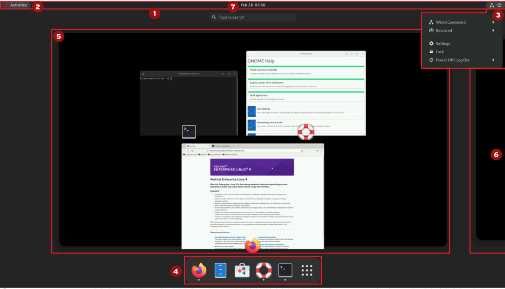

# Access the command line
- linux shell 을 활용해 여러 command 사용하는 방법에 대해 이해할 수 있다

### bash prompt
- linux 기본 shell
- prompt
  - 명령을 기다리는 화면
    ```bash
    [user@host ~] $
    ```
  - `${user명}@${hostname}`의 형태
  - 명령이 수행되는 디렉터리 정보 표시
  - 위 경우 user 명은 "user", hostname은 "host"
  - 명령수행 디렉터리: ~(user의 home directory)
  - 쉘 마지막 "$"
    - 권한이 필요없는 일반적인 사용자를 의미
    - "#"이 붙는 경우 권한이 필요한 특수 User(ex. root) 로 명령을 기다리고 있다는 의미
- 쉘 기본 사항
  - 명령, 옵션, 인수 세 가지로 구성
  - **명령(command)**: 실행할 명령
  - **옵션(option)**: 명령의 세부 동작을 조정
  - **인수(argument)**: 명령의 실행 대상이 되는 인수
  - 예시
    - `ls -al /home/user`
    - 명령: ls
    - 옵션: -al
    - 인수: /home/user
- 옵션 dash 수의 의미
  - '-' : 각 알파벳을 하나하나 옵션으로 봄
  - '--': 모든 알파벳을 하나의 옵션으로 봄
  - `-all`: a, l option 적용
  - `--all`: all(=a) option 적용
- `bind -P`
  - `bind`: 기본적으로 키 바인딩을 설정하거나 제거
  - `bind -P`: 현재 설정된 키 바인딩 목록을 읽기 전용 형식으로 출력
- 단축키
  - `ctrl + l`: 화면 claer
  - `ctrl + d`: exit logout

## 원격 서버 접속
- ssh(Secure Shell)을 활용해 접속
- private, public key를 만들어 접속하는 것이 노출될 위험이 적어 암호를 사용하는 것 보다 안전
- public key를 접속을 원하는 remote server에 저장하고 private key를 서버에 저장해두고 사용하는 방식

## 콘솔
- 물리 콘솔: 시스템과 상호 작용하는 하드웨어 디스플레이 및 키보드를 설명하는 용어
- 가상 콘솔: 각각 독립적인 로그인 세션을 지원할 수 있는 여러 논리 콘솔 중 하나

## GNOME 데스크탑
- Linux 시스템의 그래픽 사용자 인터페이스

- Activities (2번)을 사용해서 논리적인 작업 환경을 구분할 수 있음
- 아래 터미널 아이콘을 클릭해 shell로 진입할 수 있음
- 데스크탑을 사용해 명령줄 액세스
  - studunet 로 workstation 에 로그인 후, 아래 명령어 실행 필수
- `[student@workstation ~]$ lab start ${task name}`
  - 모든 환경이 잘 갖추어졌는지 확인하는 명령어
- 비밀번호 변경
  - passwd 명령어 활용
- `[student@workstation ~]$ lab finish ${task name}`
  - 연습 종료 후 연습 환경 clear

## bash shell을 사용해 명령 실행
- hardward(cpu, mem, network)와 software사이 통신을 담당하는 **linux kernel**은 모든 리눅스 시스템의 중심
- linux kernel에 명령을 내리려면 shell이 필요
- 기본 shell 명령어
  - `whoami`: 현재 login한 사용자 출력
  - `su`: 다른 사용자 계정으로 전환하거나 해당 사용자의 권한을 임시로 사용할 수 있게함
    - `su`: root 사용자로 전환
    - `su ${user}`: 특정 사용자로 전환
    - `su -`: 로그인 쉘 환경을 초기화하며 사용자 전환
- 무조건 실행
  - `';'` 활용하여 명령에 오류가 있어도 무조건 적인 실행
  - ex. `date; ls; foo; uptime`
  - foo라는 명령어가 존재하지 않아 오류가 나더라도 uptime명령어가 무조건 실행
- 조건부 실행
  - `&&` 활용하여 조건부 실행
  - ex. `foo  && uptime`
  - foo 명령어가 존재하지 않아 오류 출력 후 uptime 명령어 미실행
- pipe 실행
  - 이전 명령 실패시 pipe 이후 명령 실행
  - 이전 명령 성공시 pipe 이후 명령 실행 불필요
  - `foo || uptime` : uptime 까지 실행
  - `uptime || fo`o: uptime이 잘 실행되어 foo 미실행
- 이전 명령어 인자를 대체(`^`)
  - `ls /usr` 명령 후 `^usr^tmp = (ls /tmp)`
- 이전 명령어에 대한 직접적인 참조(`!!`)
  - `firewall-cmd --list-all -> authorization failed`
  - `sudo !! (= sudo firewall-cmd --list-all)`
- date 출력 형식
  - 인수를 사용해 형식 조정
  ```bash
  [user@host ~]$ date +%R
  20:33
  [user@host ~]$ date +%x
  02/27/2022
  ```
- history
  - 이전 명령 출력
    ```bash
    history
    1. date
    2. uptime
    ```
  - `!1` 명령어로 1번(`date`) 명령 재실행 가능
- `file` command
  - `file`: file의 type 출력
- tab을 사용해 자동완성 가능 (인자, 명령어 모두 가능)
- 파일의 처음 몇 줄(또는 바이트)을 출력하는 head 명령어
  - `head -n 5 file.txt  # 첫 5줄 출력`
- 파일의 마지막 몇 줄(또는 바이트)을 출력하는 tail 명령어
  - `tail -n 5 file.txt  # 마지막 5줄 출력`
- 인자 재활용(`esc + .` or `!$`)
- `wc`: line수나 문자 수 출력
- `ctrl +r` : 지난 명령어 history를 추적
    ```bash
    [eunbin@eunbook ~]$ man example
    No manual entry for example
    [eunbin@eunbook ~]$ man echo
    (reverse-i-search)`man ex': man example
    ```
- `!{명령어}`: 이전 명령어 중 가장 최신에 실행했던 명령어 실행
    ```bash
    histroy
    1. ls -a
    2. ls -l
    ```
  - 위의 경우 !ls -> ls -l과 동일
- back slash
  - 너무 긴 명령어를 다루기 위해 사용
