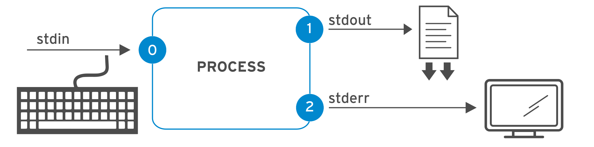

# 텍스트 파일 생성, 보기 및 편집

## 파일 또는 프로그램에 출력 리디렉션

쉘 리디렉션을 사용해 출력이나 오류를 파일에 저장하고, 파이프를 사용해 여러 CLI 프로그램을 통해 명령 출력을 처리함

### 표준 입력, 표준 출력, 표준 오류


- 프로세스는 입력을 읽고 출력을 씀
- 쉘 프롬프트에서 실행된 명령은 일반적으로 키보드에서 입력을 읽고 터미널 창으로 출력을 전송함
- 프로세스는 file descripter라는 번호가 매겨진 채널을 사용해 입력을 읽고 출력을 전송함
  - 모든 프로세스는 3개 이상의 file descripter로 시작됨
- 표준 입력(채널 0)은 키보드에서 입력을 읽음
- 표준 출력(채널 1)은 일반 출력을 터미널로 전송
- 표준 오류(채널 2)는 오류 메시지를 터미널로 전송


| 번호 | 채널 이름 | 설명      | 기본 연결 | 사용법                |
| ---- | --------- | --------- | --------- | --------------------- |
| 0    | stdin     | 표준 입력 | 키보드    | 읽기 전용             |
| 1    | stdout    | 표준 출력 | 터미널    | 쓰기 전용             |
| 2    | stderr    | 표준 오류 | 터미널    | 쓰기 전용             |
| 3+   | filename  | 기타 파일 | 없음      | 읽기, 쓰기 또는 둘 다 |


### 파일에 출력 리디렉션

- I/O(입출력) 리디렉션은 프로세스가 입력 또는 출력을 얻는 방법을 변경을 말함
- 리디렉션을 사용하면 터미널에 출력을 표시하는 대신 메시지를 파일에 저장 가능
- 또는 리디렉션을 사용하여 출력이나 오류를 폐기하여 단말기에 표시되지 않거나 저장되지 않도록 할 수 있음


**출력 리디렉션 연산자 설명** 

| 사용법       | 설명                                                         | 시각 자료             |
| ------------ | ------------------------------------------------------------ | --------------------- |
| > file       | stdout을 리디렉션하여 파일을 덮어 씀                         |  |
| >> file      | stdout을 리디렉션하여 파일에 추가                            |  |
| 2> file      | stderr을 리디렉션하여 파일을 덮어 씀                         |  |
| 2> /dev/null | /dev/null에 리디렉션하여 stderr 오류 메시지를 삭제           |  |
| > file 2>&1  | stdout 및 stderr을 리디렉션하여 동일한 파일을 덮어씀<br />(2>&1: stderr(2)를 stdout(1)과 같은 위치로 보냄) |  |
| &> file      | > file 2>&1과 동일<br />(병합 연산자, Bash 4 또는 RHEL 6 이상) |                       |
| >> file 2>&1 | stdout 및 stderr을 리디렉션하여 동일한 파일에 추가           |  |
| &>> file     | >> file 2>&1과 동일<br />(병합 연산자, Bash 4 또는 RHEL 6 이상) |                       |

- &: 파일 디스크립터 참조를 나타냄
- 리디렉션의 작업 순서가 중요
  - output.log 2>&1,  2>&1 > output.log 두 결과가 다름


### 파이프라인 구현

- 파이프라인이란 하나 이상의 명령이 세로 막대 문자(|)로 구분된 시퀀스
- 첫 번째 명령의 표준 출력을 다음 명령의 표준 입력에 연결함
- 파이프라인에서는 병합 리디렉션 연산자(&>, &>>) 사용 불가


파이프라인과 리디렉션을 조합할 때, 파이프라인 중간에서 출력 리디렉션을 사용하면 출력이 파이프라인의 다음 명령으로 전송되지 않고 파일로 전송됨

> ```
> # ls 명령의 출력은 /tmp/saved-output 파일로 전송되고, less 명령은 터미널에 아무것도 표시하지 않음
> ls > /tmp/saved-output | less
> ```

파일로도 전송하고 파이프라인의 다음 명령으로도 전송하고 싶다면, tee 명령이 제한을 해결할 수 있음


파이프라인에서 `tee`는 해당 표준 입력을 표준 출력에 복사하고, 해당 표준 출력도 명령의 인수로 지정된 파일에 리디렉션

- tee 사용 예시

  - ls -l | tee /tmp/saved-output | less
    - `ls` 명령의 출력을 `/tmp/saved-output` 파일에 리디렉션하고 `less` 명령으로 전달하여 한 번에 한 화면씩, 터미널에 표시
  - ls -t | head -n 10 | tee /tmp/ten-last-changed-files
    - 파이프라인 끝에 `tee` 명령을 사용하면 터미널에서 파이프라인에 있는 명령의 출력을 표시하는 동시에 파일에 저장
  - ls -l | tee -a /tmp/append-files
    - `tee` 명령의 `-a` 옵션을 사용하면 파일을 덮어쓰지 않고 파일에 내용을 추가

  

## 쉘 프롬프트에서 텍스트 파일 편집

`vim` 편집기를 사용하여 명령 줄에서 텍스트 파일을 생성하고 편집함

- Linux의 기본 설계 원칙은 정보 및 구성 설정을 텍스트 기반 파일에 저장하도록 지원
  - 텍스트 기반 구조에 파일을 저장할 경우 텍스트 편집기로 편집할 수 있다는 이점이 있음
- Vim은 Linux 및 UNIX 시스템에 배포된 `vi` 편집기의 개선된 버전
  - Vim은 고도로 구성 가능한 효율적인 편집기로 분할 화면 편집, 컬러 포맷팅, 텍스트 편집을 위한 강조 표시 기능 등을 제공
- Vim을 배워야 하는 주요 이유는 텍스트 기반 파일을 편집하기 위해 서버에 거의 항상 기본적으로 설치되기 때문
  - *Portable Operating System Interface*, 즉 *POSIX* 표준은 Linux에서 `vi` 편집기를 지정했으며, 다른 많은 UNIX 유사 운영 체제도 마찬가지


### Vim 사용 시작

- `vim-minimal` 패키지를 사용하면 핵심 기능이 있는 `vi` 편집기를 설치할 수 있음
  - `vi` 명령을 사용
-  `vim-enhanced` 패키지를 사용하면 포괄적인 기능 세트가 있는 Vim 편집기를 설치
  - `vim` 명령을 사용
  - `vim-enhanced` 가 설치된 경우 쉘 alias가 설정되어 있으므로 일반 사용자가 `vi` 명령을 실행하면 자동으로 `vim` 명령을 대신 가져오기도 함

### Vim 모드


- Vim 편집기는 *명령 모드*, *확장 명령 모드*, *편집 모드*, *시각적 모드*와 같은 다양한 작업 모드를 제공
- Vim을 처음 열면 네비게이션, 잘라내어 붙여넣기, 기타 텍스트 수정에 사용되는 *명령 모드*로 시작
- **i** 키를 누르면 입력한 모든 텍스트가 파일 내용이 되는 *삽입 모드(insert)*가 시작
  - **Esc**를 누르면 명령 모드로 돌아감
- **v** 키를 누르면 텍스트 조작을 위해 여러 문자를 선택할 수 있는 *시각적(visual) 모드*가 시작
  -  여러 줄인 경우 **Shift**+**V**, 블록 선택인 경우 **Ctrl**+**V**를 사용
  - 시각적 모드를 종료하려면 **v**, **Shift**+**V** 또는 **Ctrl**+**V** 키 입력
- **:** 키를 누르면 파일을 작성하여 저장하기, Vim 편집기 종료 등의 작업이 가능한 *확장 명령 모드*


### 유용한 Vim 기능

- u 키를 누르면 가장 최근 편집 내용이 실행 취소
- x 키를 누르면 단일 문자가 삭제됩니다.
- :w 명령은 파일을 작성하여 저장하고, 추가 편집을 위해 계속 명령 모드를 유지합니다.
- :wq 명령은 파일을 작성하여 저장하고, Vim을 종료합니다.
- :q! 명령은 Vim을 종료하고 마지막 작성 이후 변경된 파일 내용을 모두 취소


### Vim 구성 파일

- /etc/vimrc 및  ~/.vimrc 경로에 구성(config) 파일 관리
- 구성 파일 내에서 기본 탭 간격, 구문 강조 표시, 색 구성표 등의 동작을 지정 가능
  - 예시
    - set number: 라인 표시 제공
    - yaml: yaml 구문 강조 표시 제공

## 쉘 환경 변경

- 쉘 변수를 설정하여 명령을 실행
- Bash 시작 스크립트를 편집해서 쉘 및 환경 변수를 설정


### 쉘 변수

- 특정 쉘 세션에 고유함

```shell
[user@host ~]$ COUNT=40
[user@host ~]$ first_name=John
[user@host ~]$ file1=/tmp/abc
[user@host ~]$ _ID=RH123

# set 명령: 현재 설정된 모든 쉘 변수 표시
[user@host ~]$ set | less
BASH=/bin/bash
BASHOPTS=checkwinsize:cmdhist:complete_fullquote:expand_aliases:extglob:extquote\
:force_fignore:globasciiranges:histappend:interactive_comments:login_shell:progc\
omp:promptvars:sourcepath
BASHRCSOURCED=Y

# 쉘 변수의 참조, &
[user@host ~]$ COUNT=40
[user@host ~]$ echo COUNT
COUNT
[user@host ~]$ echo $COUNT
40
```


### 쉘 변수를 사용하여 Bash 구성

- 일부 쉘 변수는 Bash가 시작될 때 설정됨
  - 예를 들어 `HISTFILE`, `HISTFILESIZE`, `HISTTIMEFORMAT` 쉘 변수
    - `~/.bash_history` 파일에서 저장
  - `PS1` 변수
    - 쉘 프롬프트의 모양을 결정하는 변수
    -  `bash`(1) 도움말 페이지의 "프롬프트" 섹션에는 프롬프트에서 지원하는 다양한 특수 문자 확장 안내


### 환경 변수

- 쉘은 해당 쉘을 통해 실행하는 프로그램에 *환경* 을 제공함
- 제공되는 환경에는 파일 시스템의 현재 작업 디렉터리, 프로그램에 전달된 명령줄 옵션, *환경 변수*의 값에 대한 정보가 포함됨
- 프로그램은 이러한 환경 변수를 사용하여 동작이나 기본 설정을 변경할 수 있음
- 쉘이 기본적으로 제공되는 환경 변수
  - $HOME: 사용자 홈 디렉터리의 파일 이름으로 자동으로 설정
  - $LANG: 로케일 인코딩을 설정
  - $PATH: 실행 가능한 바이너리가 들어 있는, 콜론으로 구분된 디렉터리 목록

```shell
[user@host ~]$ export EDITOR=vim

# 쉘의 모든 환경 변수 표시, env
[user@host ~]$ env
...output omitted...
LANG=en_US.UTF-8
HISTCONTROL=ignoredups
HOSTNAME=host.example.com
XDG_SESSION_ID=4
...output omitted...
```


### 자동 변수 설정

- Bash가 시작되면 쉘 환경을 초기화하는 쉘 명령이 포함된 여러 개의 텍스트 파일이 실행됨
- 쉘이 시작될 때 쉘 변수 또는 환경 변수를 자동으로 설정하려면 이러한 Bash 시작 스크립트를 편집할 수 있음
- 실행되는 정확한 스크립트는 쉘의 종류에 따라 달라짐
  - 대화형 쉘에는 사용자가 직접 명령을 입력
    - 사용자가 직접 명령어를 입력하고, 그 결과를 즉시 확인할 수 있는 쉘(터미널)
    - `/etc/profile` 및 `~/.bash_profile` 파일에서 Bash 환경을 구성
    - `/etc/profile` 및 `~/.bash_profile` 파일은 각각 `/etc/bashrc` 및 `~/.bashrc` 파일도 소싱
  - 비대화형 쉘은 스크립트와 같이 사용자 개입 없이 백그라운드에서 실행
    - 사용자의 직접적인 입력 없이 스크립트나 파이프라인 등을 통해 명령어가 실행되는 쉘
    - `BASH_ENV` 변수가 정의하는 파일을 호출
  - 로그인 쉘은 사용자가 터미널을 통해 로컬로 로그인하거나 SSH 프로토콜을 통해 원격으로 로그인할 때 호출
    - 사용자가 시스템에 로그인할 때 시작되는 쉘(SSH)
  - 비로그인 쉘은 GNOME GUI에서 터미널 열기와 같이 기존 세션에서 호출
    - 시스템에 이미 로그인한 상태에서 새 터미널 세션을 열거나, 스크립트를 실행할 때 시작되는 쉘
- 모든 대화형 쉘에서 사용할 수 있는 변수를 생성하려면 `~/.bashrc` 파일을 편집
- 사용자가 로그인한 후 변수를 한 번만 적용하려면 `~/.bash_profile` 파일에서 정의


## Quiz

- 다음 리디렉션 commands는 어떻게 동작하게 되는가?

  - tail -n 100 /var/log/secure > /tmp/last-100-log-secure
  - echo "new line of information" >> /tmp/many-lines-of-information
  - find /etc -name passwd > /tmp/output 2> /dev/null
  - find /etc -name passwd &> /tmp/all-message-output

- 다음 파이프라인 활용 commands는 어떻게 동작하게 되는가?

  - ls -t | head -n 10 > /tmp/first-ten-changed-files

- 다음 중 출력을 파일로 전송하고 오류를 다른 파일로 전송하는 출력 리디렉션 연산자는 무엇인가?

  - ` > file 2> file2`
  - `> file 1> file2`
  - `> file &2> file2`
  - `| tee file`

  


## Quiz 정답

- 다음 리디렉션 commands는 어떻게 동작하게 되는가?
  - tail -n 100 /var/log/secure > /tmp/last-100-log-secure
    - `/var/log/secure` 파일의 마지막 100줄을 `/tmp/last-100-log-secure` 파일에 복사
  - echo "new line of information" >> /tmp/many-lines-of-information
    - 기존 `/tmp/many-lines-of-information` 파일에 줄을 추가
  - find /etc -name passwd > /tmp/output 2> /dev/null
    - 프로세스 출력을 `/tmp/output` 파일에 저장하고 오류 메시지를 삭제
  - find /etc -name passwd &> /tmp/all-message-output
    - 출력 및 생성된 오류를 `/tmp/all-message-output` 파일에 함께 저장
