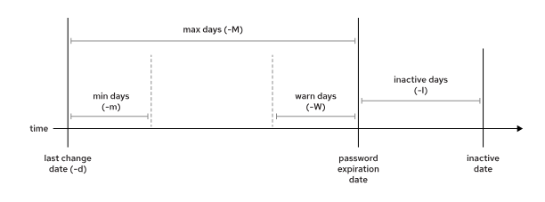

# User and Group
- 로컬 사용자 및 그룹을 생성, 관리, 삭제하고 로컬 암호 정책을 관리할 수 있다.

## User and Group Concept
- 각 개념마다 대표하는 id 존재
  - process -> pid
  - user -> uid
  - group -> gid
  - file -> inode

### User
- 명령을 실행할 수 있는 프로그램 간에 보안 경계를 제공
- 식별하기 쉽도록 사용자 이름이 존재(ex. root)
- 내부적으로 시스템은 할당된 고유 식별 번호, UID로 사용자 계정을 구별 
  - 시스템의 모든 프로세스는 특정 사용자로 실행 
  - 모든 파일에는 특정 사용자가 소유자로 지정
  - 파일 소유권을 사용하여 사용자별 파일 액세스를 제어
- "수퍼유저", "시스템 사용자", "일반 사용자"로 분류 가능
- 수퍼유저
  - 보통 root
  - 이름과 관계없이 식별 번호는 "0"번
  - 모든 시스템 액세스 권한을 가짐
- 시스템 사용자
  - 지원 서비스를 제공하는 프로세스에서 사용
  - 시스템에 대한 액세스가 제한
  - 일반적으로 해당 계정으로 로그인 불가
  - ex. `mysql`, `postfix`
- 일반 사용자
  - 일상적인 사용
  - 시스템에 대한 액세스가 제한
  - ex. `eunbin`, `irteam`
- `/etc/passwd`
  - user 정보 저장 파일
  - 예전에는 pw정보가 저장되었지만 현재는 그렇지 않음
  - `user01:x:1000:1000:User One:/home/user01:/bin/bash`
    - user01: 사용자 이름
    - x: 사용자의 암호화된 암호가 여기에 저장. 이제 자리 표시자
    - 1000: 이 사용자 계정의 UID 번호
    - 1000: 이 사용자 계정의 기본 그룹에 대한 GID 번호(primary group)
    - User One: 이 사용자에 대한 간단한 주석, 설명
    - /home/user01: 사용자의 홈 디렉터리 및 로그인 쉘이 시작될 때의 초기 작업 디렉터리
    - /bin/bash: 로그인 시 실행되는 이 사용자의 기본 쉘 프로그램

### Group
- 파일 및 기타 시스템 리소스에 대한 액세스를 공유해야 하는 사용자 컬렉션
- 인식하기 쉽도록 그룹 이름 존재
- 내부적으로 시스템은 할당된 고유 식별 번호, GID로 그룹을 구별
- `/etc/group`
  - group 정보 저장 파일
  - `group01:x:10000:user01,user02,user03`
    - group01: 이 그룹의 이름
    - x: 사용되지 않는 그룹 암호 필드이며 지금은 자리 표시자
    - 10000: 이 그룹의 GID 번호(10000)
    - user01,user02,user03 : 보조 그룹으로 이 그룹의 멤버인 사용자 목록
- `/etc/shadow`: 비밀번호 hash 정보(hash 값, 변경 일자, 경고, 비활성 값.. ) 확인 가능 파일

### 기본 그룹 보조 그룹 (primary, secondary group)
- 기본 그룹
  - 모든 사용자는 정확히 하나의 기본 그룹을 가짐(기본 그룹)
  - 일반 사용자를 생성하는 경우 사용자의 기본 그룹이 될 그룹이 사용자와 동일한 이름으로 생성
  - 기본 그룹은 사용자가 생성한 파일을 소유
- 보조 그룹
  - 사용자에게는 보조 그룹 존재할 수 있음
  - 보조 그룹의 멤버십은 `/etc/group` 파일에 저장
  - 기본 그룹이든, 보조 그룹이든 간에 해당 그룹에 액세스 권한이 있는지에 따라 사용자에게 파일 액세스 권한이 부여
  - 예를 들어 user01 사용자의 기본 그룹이 user01이고 보조 그룹은 wheel 및 webadmin인 경우, 사용자는 세 그룹 중 하나라도 읽기 가능한 파일이라면 해당 파일을 읽을 수 음

### 관련 cmd
- `id`
  - 사용자 정보 표시
    ```bash
    [user01@host ~]$ id user02
    uid=1002(user02) gid=1001(user02) groups=1001(user02) context=unconfined_u:unconfined_r:unconfined_t:s0-s0:c0.c1023
    ```
    - groups 에 보조 그룹을 포함해 그룹 정보 표시 
    - context: **SELinux (Security-Enhanced Linux)**에서 사용자의 **보안 컨텍스트(Security Context)**를 나타냄
    | 필드               | 의미 |
    |-------------------|------|
    | `unconfined_u`   | **SELinux 사용자** → 제한이 없는 사용자 (`unconfined_u`) |
    | `unconfined_r`   | **SELinux 역할(Role)** → 제한 없는 역할 (`unconfined_r`) |
    | `unconfined_t`   | **SELinux 타입(Type)** → 제한 없는 타입 (`unconfined_t`) |
    | `s0-s0:c0.c1023` | **SELinux 보안 레벨 및 범위** (MLS/MC) |
- `ls`
    ```bash
    [user01@host ~]$ ls -l mytextfile.txt
    -rw-rw-r--. 1 user01 user01 0 Feb  5 11:10 mytextfile.txt
    [user01@host]$ ls -ld Documents
    drwxrwxr-x. 2 user01 user01 6 Feb  5 11:10 Documents
    ```
    - $권한 $inode_link $own_user $own_group $file_size 형태로 출력
- `ps`
  - 첫번째 인자에 uid 출력
    ``` bash
    [user01@host ~]$ ps -au
    USER     PID %CPU %MEM    VSZ   RSS TTY    STAT START  TIME COMMAND
    root    1690  0.0  0.0 220984  1052 ttyS0  Ss+  22:43  0:00 /sbin/agetty -o -p -- \u --keep-baud 1
    user01  1769  0.0  0.1 377700  6844 tty2   Ssl+ 22:45  0:00 /usr/libexec/gdm-x-session --register-
    ```

## Gain SuperUser Access

### 사용자 계정 전환
- `su`
    - user02로 전환
    - "-"("--login, -l")을 함께 사용하는 것을 man page에서 권장
      - 사용자의 환경 변수(.bashrc, .bash_profile)를 적용한 새 셸을 시작함
    ```bash
    [user01@host ~]$ su - user02
    Password: user02_password
    [user02@host ~]$
    ```
    - 이름 생략시 root로 로그인 시도
    ```bash
    [user01@host ~]$ su -
    Password: root_password
    [root@host ~]#
    ```
    - "-"없이 사용하는 su 는 해당 사용자로 쉘을 시작하지만 원래 사용자의 환경 설정을 사용한다는 것

- `sudo`
- 사용자가 암호를 사용하여 root로 직접 시스템에 로그인할 수 없거나 `su`를 사용하여 대화형 쉘을 가져올 수 없는 경우 sudo 명령을 사용하여 root 액세스 권한을 얻을 수 있음
- su 명령과 달리, sudo 를 사용하는 경우 일반적으로 사용자가 액세스하려는 사용자 계정의 암호가 아닌 본인 암호를 입력하여 인증
- sudo의 또 다른 이점은 기본적으로 실행된 모든 명령을 `/var/log/secure`에 기록
- `-i` 옵션으로 계정으로 전환하고 해당 사용자의 기본 쉘(일반적으로 bash) 및 관련된 대화형 로그인 스크립트를 실행할 수 있음

| 구분 | su | su - | sudo |
|---|---|---|---|
| 새 사용자 되기 | 예 | 예 | 에스컬레이션된 명령 기준 |
| 환경 | 현재 사용자 | 새 사용자 | 현재 사용자 |
| 암호 필요 | 새 사용자 | 새 사용자 | 현재 사용자 |
| 권한 | 새 사용자와 동일 | 새 사용자와 동일 | `/etc/sudoers` 파일에 정의된 특정 권한만 사용 |
| 활동 기록 | su 명령만 | su 명령만 | 에스컬레이션된 명령 기준 |

- example
```bash
# user02의 계정을 잠금 상태로 변경
[user01@host ~]$ sudo usermod -L user02
[sudo] password for user01: user01_password
[user01@host ~]$ su - user02
Password: user02_password
su: Authentication failure
[user01@host ~]$
```

### sudo 구성 파일
- /etc/sudoers 파일과 /etc/sudoers.d/ 디렉토리로 sudo 권한을 관리
- /etc/sudoers 파일
  - 시스템의 주요 sudo 설정 파일입니다
  - 어떤 사용자가 어떤 권한으로 sudo를 사용할 수 있는지 정의
  - 직접 편집하는 것은 권장되지 않으며 visudo 명령어를 통해 편집 필요
- /etc/sudoers.d/ 디렉토리
  - sudo 설정을 모듈화하기 위한 디렉토리입
  - 이 디렉토리 내의 파일들은 자동으로 sudo 설정에 포함
  - 주 설정 파일을 수정하지 않고도 새로운 sudo 규칙을 추가할 수 있음
- 설정  
  - `devops ALL=(ALL) NOPASSWD:ALL`
  - devops 사용자는
  - 모든 호스트에서 (ALL=)
  - 모든 사용자로 명령을 실행할 수 있는 권한을 부여 ((ALL))
  - 비밀번호 입력 없이 (NOPASSWD:)
  - 모든 명령을 실행할 수 있음 (ALL)
- group의 경우 "%" prefix (`%group01        ALL=(ALL)       ALL`)

## Manage Local User Account

### Manage Local User
- 생성 전 `getent password` 로 시스템에 관련 사용자가 있는지 확인할 수 있음
  - `/etc/passwd`를 살펴보는 것 보다 안전
  - `getent`: 다양한 시스템 데이터베이스(예: 사용자 계정, 호스트, 그룹, 서비스 등)에서 정보를 조회. `/etc/nsswitch.conf` 파일에 정의된 데이터 소스에 따라 정보를 가져옴
  
- `useradd`: 1000이상으로 uid 부여하여 user 생성
- `usermod`: user 설명을 추가하는 등 편집 작업

| usermod 옵션 | 사용법 |
|---|---|
| -a, --append | 보조 그룹 집합을 새로운 집합으로 바꾸는 대신 보조 그룹을 사용자의 현재 그룹 멤버십 집합에 추가하려면 -G 옵션과 함께 사용합니다. |
| -c, --comment COMMENT | 주석 필드에 COMMENT 텍스트를 추가합니다. |
| -d, --home HOME_DIR | 사용자 계정의 홈 디렉터리를 지정합니다. |
| -g, --gid GROUP | 사용자 계정에 대한 기본 그룹을 지정합니다. |
| -G, --groups GROUPS | 사용자 계정에 대해 쉼표로 구분된 보조 그룹 목록을 지정합니다. |
| -L, --lock | 사용자 계정을 잠급니다. |
| -m, --move-home | 사용자의 홈 디렉터리를 새 위치로 이동합니다. -d 옵션과 함께 사용해야 합니다. |
| -s, --shell SHELL | 사용자 계정에 대한 특정 로그인 쉘을 지정합니다. |
| -u, --unlock | 사용자 계정의 잠금을 해제합니다. |

- `userdel`: user 삭제
  - `-r` 옵션 없다면 기본적으로 홈디렉터리를 제거하지 않음
  - 새로운 user가 삭제된 user의 uid를 사용해 파일 권한이 예상치 못한 방식으로 부여될 수 있음
  - 이런 시나리오를 방지하기 위해 user를 삭제하지 않고 잠금 상태로 변경할 수 있음(`usermod -L`)
    ```bash
    [root@host ~]# useradd user01
    [root@host ~]# ls -l /home
    drwx------. 3 user01  user01    74 Mar  4 15:22 user01
    [root@host ~]# userdel user01
    [root@host ~]# ls -l /home
    drwx------. 3    1000    1000   74 Mar  4 15:22 user01
    [root@host ~]# useradd -u 1000 user02
    [root@host ~]# ls -l /home
    drwx------. 3 user02     user02       74 Mar  4 15:23 user02
    drwx------. 3 user02     user02       74 Mar  4 15:22 user01
    ```

### Password 
- `passwd` 로 pw 상태 및 세팅 가능
  - `-S` password 상태 출력
    - 잠겨있는지, 세팅이 됐는지 등 확인 가능
    ```bash
    [root@servera ~]# passwd -S ben
    ben LK 2022-06-06 0 99999 7 -1 (Password locked.)
    [root@servera ~]# passwd ben
    Changing password for user ben.
    New password:
    BAD PASSWORD: The password is shorter than 8 characters
    Retype new password:
    passwd: all authentication tokens updated successfully.
    [root@servera ~]# passwd -S ben  
    ben PS 2022-06-06 0 99999 7 -1 (Password set, SHA512 crypt.)
    [root@servera ~]# usermod -L ben
    [root@servera ~]# passwd -S ben
    ben LK 2022-06-06 0 99999 7 -1 (Password locked.)
    ```

## Manage Local Group Account
### Manage Local Group Account
- 생성 전
  - `/etc/group`을 통해 존재 여부를 확인할 수 있음
  - `getent group` 명령어를 통해서 전체적인 시스템에 그룹 정보가 있는지 확인 가능(권장)
- `groupadd ${group_name}`: group 생성
    ```bash
    [root@servera ~]# groupadd developers
    [root@servera ~]# grep developers /etc/group
    developers:x:1003:
    [root@servera ~]# getent group developers
    developers:x:1003:
    ```
    - `-r(--system)`: system group 생성
    - `SYS_GID_MIN`, `SYS_GID_MAX`: system group gid min max 값(in `/etc/login.defs`)
- `groupmod`: 그룹 수정
    ```bash
    [root@host ~]# groupmod -n group0022 group02
    [root@host ~]# tail /etc/group
    ...output omitted...
    group0022:x:988:
    ```
- `groupdel`: 그룹 삭제
- example
  - `newgrp`: 일시적으로 기본 그룹을 다른 그룹으로 변경
  - `groups`: 속하는 그룹 출력
    ```bash
    # user 생성 시 group 추가
    [root@servera ~]# useradd -G developers,wheel,admins ricardo
    [root@servera ~]# id ricardo
    uid=1003(ricardo) gid=1004(ricardo) groups=1004(ricardo),10(wheel),1003(developers),985(admins)
    [root@servera ~]# sudo -u ricardo -i
    [ricardo@servera ~]$ touch foo
    [ricardo@servera ~]$ ls -l foo
    -rw-r--r--. 1 ricardo ricardo 0 Jun  7 16:29 foo
    [ricardo@servera ~]$ newgrp admins
    [ricardo@servera ~]$ id
    uid=1003(ricardo) gid=985(admins) groups=985(admins),10(wheel),1003(developers),1004(ricardo) context=unconfined_u:unconfined_r:unconfined_t:s0-s0:c0.c1023
    [ricardo@servera ~]$ touch bar
    [ricardo@servera ~]$ ls -l bar
    -rw-r--r--. 1 ricardo admins 0 Jun  7 16:29 bar
    [ricardo@servera ~]$
    ```

## Manage User Password
- user account info -> `/etc/passwd`
- group account info -> `/etc/group`
- password info -> `/etc/shadow`
- `/etc/passwd`에서 비밀번호를 관리하다 민감한 정보라 root 사용자만 읽을 수 있는 `/etc/shadow`에서 관리
- `/etc/shadow`
    ```bash
    [root@host ~]# cat /etc/shadow
    ...output omitted...
    user03:$6$CSsXcYG1L/4ZfHr/$2W6evvJahUfzfHpc9X.45Jc6H30E:17933:0:99999:7:2:18113:
    ```
    - user03: 사용자 계정의 이름
    - $6$CSsXcYG1L/4ZfHr/$2W6evvJahUfzfHpc9X.45Jc6H30E: 암호화 방식과 해시 암호
      - `$`기호로 분리해서 읽음
      - 6: 사용 중인 해시 알고리즘. 6 은 RHEL 9 기본값인 SHA-512 해시를 나타내고, 1 은 MD5를 나타내고, 5 는 SHA-256을 나타냄
      - CSsXcYG1L/4ZfHr/: 암호를 암호화된 방식의 해시로 만들 때 사용하는 salt
      - 2W6evvJahUfzfHpc9X.45Jc6H30E: salt와 일반 텍스트 암호를 결합한 후 암호화된 방식의 해시 값
    - 17933: epoch부터 암호가 마지막으로 변경된 시점까지의 일수. 여기서 epoch는 1970-01-01 (UTC 시간대)
    - 0: 사용자가 다시 변경할 수 있기 전에 마지막 암호가 변경된 이후 경과해야 하는 최소 일수
    - 99999: 암호가 만료되기 전에 암호 변경 없이 유지할 수 있는 최대 일수. 빈 필드는 암호가 만료되지 않음을 의미
    - 7: 사용자에게 암호 만료를 미리 경고하는 일수입니다.
    - 2: 암호가 만료된 날부터 계정이 자동으로 잠기기 전에 활동 없이 유지할 수 있는 일수입니다.
    - 18113: epoch 이후 계정이 만료되는 날까지의 일수입니다. 빈 필드는 계정이 만료되지 않음을 의미합니다.
    - 마지막 필드는 일반적으로 비어 있으며, 나중에 사용하기 위해 예약

### 암호 에이징 구성

- `chage`: 암호 정책 변경 명령어
- `chage -m 0 -M 90 -W 7 -I 14 sysadmin05`
  - 최소 사용 기간 없음
  - 최대 사용 기간 90일
  - 경고 표시 7일
  - 비활성기간 14일
    - 비활성 날짜는 비밀번호가 만료된 후 사용자가 계정에 로그인하지 않았을 때 계정을 비활성화(잠금) 하는 데 필요한 기간
    - root 계정으로 해제 가능
  - d: 최종 비밀번호 변경 날짜를 설정
- `/etc/login.defs` 파일에서 기본 암호 에이징 구성을 변경 가능
  - PASS_MAX_DAYS: 암호 기본 최대 사용 기간
  - PASS_MIN_DAYS: 암호 기본 최소 사용 기간
  - PASS_WARN_AGE: 암호 기본 경고 기간

### 액세스 제한
- `usermod` 명령의 -L 옵션으로 계정을 잠금 상태로 변경 가능
  - -U 옵션으로 해제 가능
```bash
[root@host ~]# usermod -L sysadmin03
[user01@host ~]$ su - sysadmin03
Password: redhat
su: Authentication failure
```
- `nologin` shell
  - 대화형으로 시스템에 로그인하지 않으려는 사용자 계정을 위한 대체 쉘 역할
  ```bash
  [root@host ~]# usermod -s /sbin/nologin newapp
  [root@host ~]# su - newapp
  Last login: Wed Feb  6 17:03:06 IST 2019 on pts/0
  This account is currently not available.
  ```