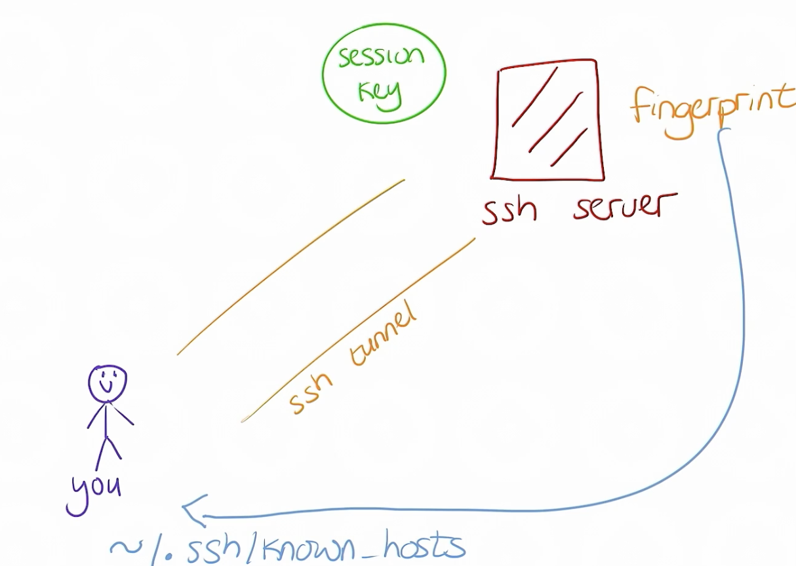
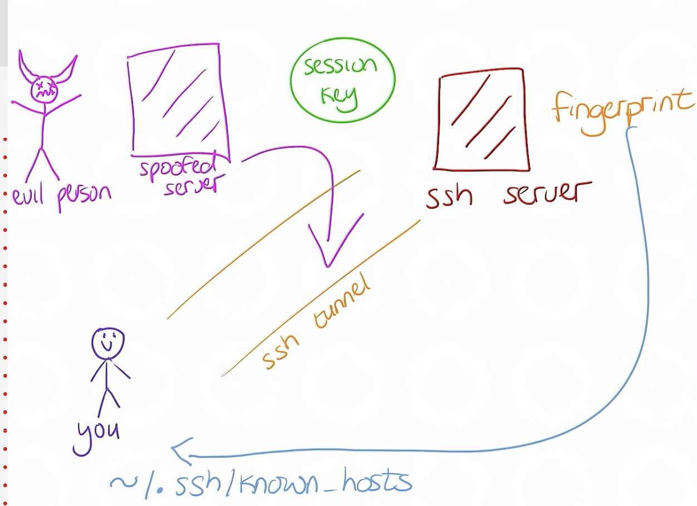

## Remote Access by SSH
### SSH
  - Secure Shell
  - 오픈된 네트워크 공간에서 SSH 프로토콜을 사용하여 암호화된 보안 통신 가능
- CLI
  - ssh ${HostName}
    - 로그인한 User 명으로 원격 Host에 로그인 시도
  - ssh ${userName}@{HostName}
    - user를 지정하여 로그인
  - ssh ${userName}@{HostName} {remote cmd}
    - 원격 명령도 실행 가능
    ```bash
    [developer1@host ~]$ ssh developer2@hosta hostname
    developer2@hosta's password: shadowman
    hosta.lab.example.com
    [developer1@host ~]$
    ```
  - exit 명령으로 로그아웃

### 원격 사용자 식별
- `w`명령으로 현재 로그인 사용자 목록을 조회할 수 있음
```bash
[developer1@host ~]$ ssh developer1@hosta
developer1@hosta's password: redhat
[developer1@hosta ~]$ w -f
 16:13:38 up 36 min,  1 user,  load average: 0.00, 0.00, 0.00
USER     TTY      FROM             LOGIN@   IDLE   JCPU   PCPU WHAT
developer2   pts/0    172.25.250.10    16:13    7:30   0.01s  0.01s -bash
developer1   pts/1    172.25.250.10    16:24    3.00s  0.01s  0.00s w
[developer2@hosta ~]$
```
  - developer2 사용자가 IP 주소가 172.25.250.10 인 호스트에서 오늘 16:13 에 의사 터미널 0 의 시스템에 로그인했으며, 쉘 프롬프트에서 7분 30초 동안 유휴 상태
  - developer1 사용자가 의사 터미널 1의 시스템에 로그인했으며, w 명령을 실행한 후 3초 동안 유휴 상태
  * tty/N: 물리적 콘솔에서 로그인한 세션.
  * pts/N: SSH 같은 프로그램 활용해서 로그인

### SSH 호스트 키
- SSH 데몬은 시작할 때 고유한 지문을 가지고 시작
  - `/etc/ssh`에 키 목록 확인 가능
- SSH 클라이언트가 SSH 서버에 연결하면 서버는 로그인하기 전에 공개 키의 사본을 클라이언트에 전송
- 데이터 암호화에 사용할 세션 키를 만들고 해당 키를 private key로 암호화하여 client에 전달


- 서버의 공개키 사본은 `/etc/ssh/ssh_known_hosts` 또는 `~/.ssh/known_host`
- `StrictHostKeyChecking`
  - `ssh -o StrictHostKeyChecking=yes user@192.168.1.100`
    - `known_hosts` 파일에 없는 서버에 처음 연결하는 경우, SSH는 경고를 출력하고 즉시 연결을 차단
  - `ssh -o StrictHostKeyChecking=no user@192.168.1.100`
    - `known_host` 파일에 없는 서버라도 자동으로 연결을 허용하고 키를 저장
  - 기본은 `StrictHostKeyChecking=ask`
    - 새로운 서버에 연결할 때, 사용자가 직접 키를 신뢰할지 여부를 입력해야 합니다.


- 위 같은 방식으로 중간에 스푸핑 서버가 존재해도 기존에 연결했던 서버의 공개키와 다른 것을 알 수 있음
```bash
@@@@@@@@@@@@@@@@@@@@@@@@@@@@@@@@@@@@@@@@@@@@@@@@@@@@@@@@@@@
@    WARNING: REMOTE HOST IDENTIFICATION HAS CHANGED!     @
@@@@@@@@@@@@@@@@@@@@@@@@@@@@@@@@@@@@@@@@@@@@@@@@@@@@@@@@@@@
IT IS POSSIBLE THAT SOMEONE IS DOING SOMETHING NASTY!
Someone could be eavesdropping on you right now (man-in-the-middle attack)!
It is also possible that a host key has just been changed.
The fingerprint for the ECDSA key sent by the remote host is
SHA256:hxttxb/qVi1/ycUU2wXF6mfGH++Ya7WYZv0r+tIkg4I.
Please contact your system administrator.
Add correct host key in /home/user/.ssh/known_hosts to get rid of this message.
Offending ECDSA key in /home/user/.ssh/known_hosts:12
ECDSA host key for server1.example.com has changed and you have requested strict checking.
Host key verification failed.
```
- 또는 ssh 데몬을 재시작하면 고유 key가 변경되면서 위 에러가 발생할 수 있음
  - 재시작 전 key 백업 권장
- known_host 파일에 저장된 정보를 삭제하는 등 방법으로 다시 호스트의 키를 세팅할 수 있음

## SSH 키 기반 인증 구성
- 비밀번호 로그인 보다 암호키 사용 권장
  - Brute Force Attack 방지
  - 비밀번호보다 키가 더 많은 비트를 사용, 자동화 가능
- PKI(공개 키 암호화)를 기반으로 하는 키 기반 인증

### SSH 키 생성
- `ssh-keygen -N {pw} -f {저장 경로}`
  - 비밀번호를 설정하는 경우 해당 Key를 사용할 때 마다 암호를 입력해야함
  - 로그인 세션에서 처음 사용할 때 암호를 캐시한 다음, 동일 세션에서 이후 개인키를 사용할 떄 마다 암호를 제공하는 ssh-agent 키 관리자를 로컬에서 사용할 수 있음

### SSH Key 공유
- 원격 시스템에 `ssh-copy-id`명령으로 공개 키를 복사할 수 있음
```bash
[user@host ~]$ ssh-copy-id -i .ssh/key-with-pass.pub user@remotehost
/usr/bin/ssh-copy-id: INFO: Source of key(s) to be installed: "/home/user/.ssh/id_rsa.pub"
/usr/bin/ssh-copy-id: INFO: attempting to log in with the new key(s), to filter out any that are already installed
/usr/bin/ssh-copy-id: INFO: 1 key(s) remain to be installed -- if you are prompted now it is to install the new keys
user@remotehost's password: redhat
Number of key(s) added: 1

Now try logging into the machine, with:   "ssh 'user@remotehost'"
and check to make sure that only the key(s) you wanted were added.
```
- 다음 연결부터는 개인키를 사용해 접근 가능

### 키 관리자 사용
- 암호를 사용한 개인키 사용시 매번 암호 입력이 필요함
- 암호를 캐시하도록 ssh-agent 키 관리자 구성 가능 
- 로그인시 자동으로 동작하도록 ssh-agent 키 관리자 구성
- ssh-agent 시작
```bash
[user@host ~]$ eval $(ssh-agent)
Agent pid 10155
```
- ssh-agent를 수행하면 아래와 같은 출력
```bash
SSH_AUTH_SOCK=/tmp/ssh-XXXXXX/agent.10155; export SSH_AUTH_SOCK;
SSH_AGENT_PID=10155; export SSH_AGENT_PID;
echo Agent pid 10155;
```
- 암호화된 키 등록
```bash
[user@host ~]$ ssh-add .ssh/key-with-pass
Enter passphrase for .ssh/key-with-pass: your_passphrase
Identity added: .ssh/key-with-pass (user@host.lab.example.com)
```

### SSH CLient 구성
- `~/.ssh/config`파일을 생성해 사전 SSH 연결 가능
```bash
[user@host ~]$ cat ~/.ssh/config
Host ng2
    User eunbin
    HostName test.naver.com
Host tre-gpu-5
    User irteam
    HostName gpu005.clova.nfra.io
    Port 9999
    IdentityFile  ~/.ssh/gpu.pri
    ProxyJump ng2
```

## SSH 사용자 구성 사용자 지정
### SSH 서버 구성
- `/etc/ssh/sshd_config`에 기본 설정 저장
  - 기본값들이 주석으로 표기되어있음
- 이전 `/etc/sudoers` config 설정 처럼 ssh 설정도 `/etc/ssh/sshd_config.d` 하위에 config 파일 구성 가능
### 슈퍼 유저로 로그인하지 못하도록
- `PermitRootLogin yes`
- `[root@host ~]# systemctl reload sshd` 로 다시 로드 필요
- 비밀번호 입력 창 까지는 나옴
### 암호 기반 인증 금지
- `PasswordAuthentication yes`
- 비밀번호 로그인을 실행할 수 없도록
### 접근 유저, 그룹 설정
- `AllowUsers` or `AllowGroups`로 로그인 유저 제한 가능 
- `Permission denied` 에러 발생
