# Cockpit
- 서버 관리를 위한 웹 기반 그래픽 인터페이스
- 리눅스 초보자를 포함해 서버를 쉽게 그래픽 방식으로 관리하고 싶은 경우 유용함
- 전체 리눅스 시스템의 개요를 빠르게 확인할 수 있음

### 간단한 사용  
- Linux를 쉽게 탐색할 수 있게 해줌 명령어를 외울 필요가 없음
- 웹 브라우저에서 서버 상태를 확인하고 마우스를 사용해 시스템 작업을 수행할 수 있음
- 컨테이너 시작, 저장소 관리, 네트워크 설정 및 로그 확인 등을 쉽게 할 수 있음
- 기본적으로 Cockpit은 개별 서버용 그래픽 "데스크톱 인터페이스"

### 통합  
- Cockpit은 이미 시스템에 존재하는 API를 사용하므로, 새로운 하위 시스템을 만들거나 자체 도구 레이어를 추가하지 않음
- 기본적으로 Cockpit은 시스템의 일반 사용자 로그인 및 권한을 사용
- Cockpit은 시스템 리소스를 많이 사용하지 않으며, 사용하지 않을 때 백그라운드에서 실행되지도 않음
- 필요할 때만 **systemd 소켓 활성화**를 통해 실행 

## 설치
- 패키지 설치
```bash
$ sudo yum install cockpit
Repository appstream is listed more than once in the configuration
Repository baseos is listed more than once in the configuration
Repository codeready is listed more than once in the configuration
Repository highavailability is listed more than once in the configuration
Repository resilientstorage is listed more than once in the configuration
Repository updates is listed more than once in the configuration
마지막 메타자료 만료확인(0:18:54 이전): 2025년 03월 22일 (토) 오후 04시 22분 39초.
꾸러미 cockpit-310.4-1.el8_10.x86_64가 이미 설치되어 있습니다.
종속성이 해결되었습니다.
처리가 필요하지 않습니다.
완료되었습니다!
```
-  Cockpit 서비스 활성화 및 즉시 시작
```bash
$ sudo systemctl enable --now cockpit.socket
Created symlink /etc/systemd/system/sockets.target.wants/cockpit.socket → /usr/lib/systemd/system/cockpit.socket.
```

## 접속
- 그런데 irteam, irteamsu 계정 비밀번호를 모르네..
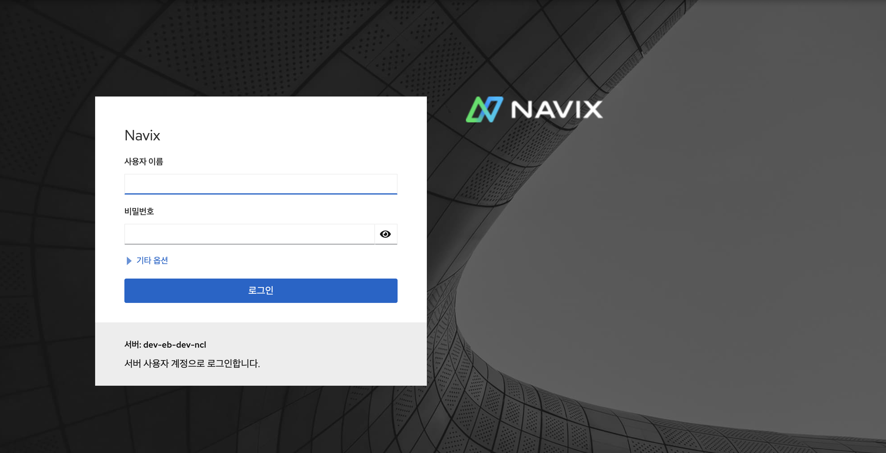

- red hat 가상 머신으로 접속
  - student 비밀번호 입력해서 administrator 권한으로 업그레이드 할 수 있음
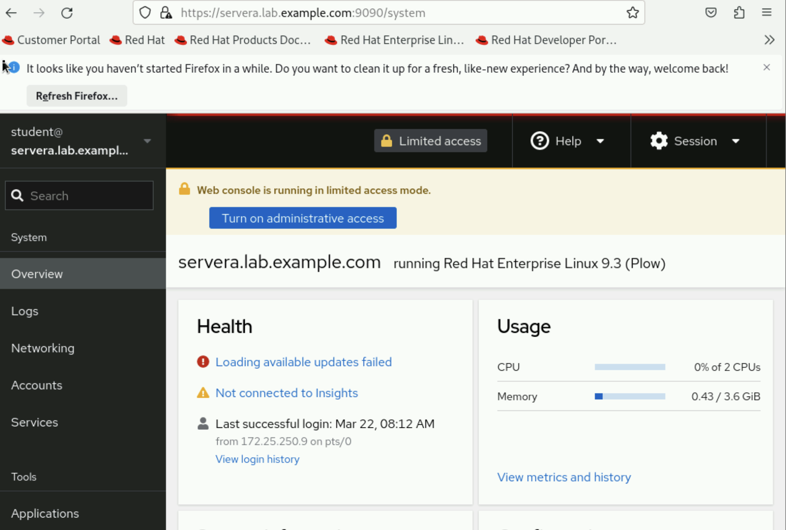

- 시스템 로그 확인 가능
  - 로그레벨, 발생 기한 조정 가능. 나중에 분석할 때 유용할 것 같음
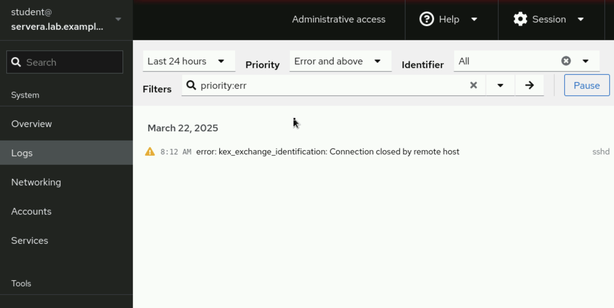
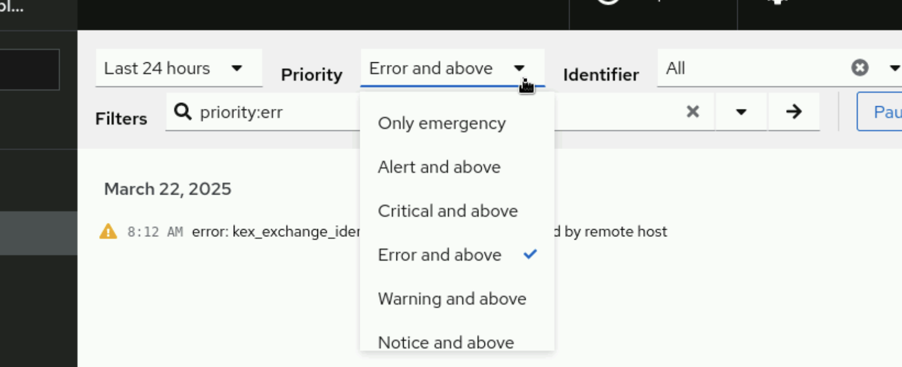

- 네트워크 서비스 제어 가능
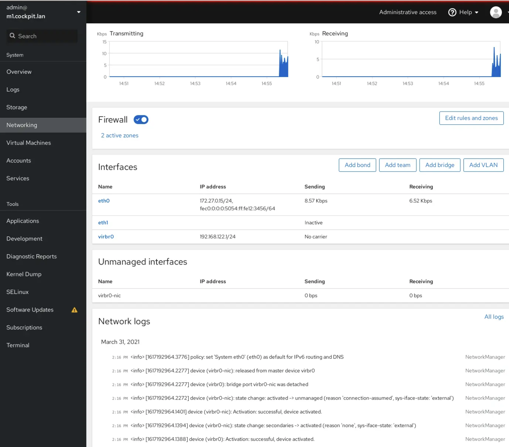
  - 방화벽 설정 수정 가능
  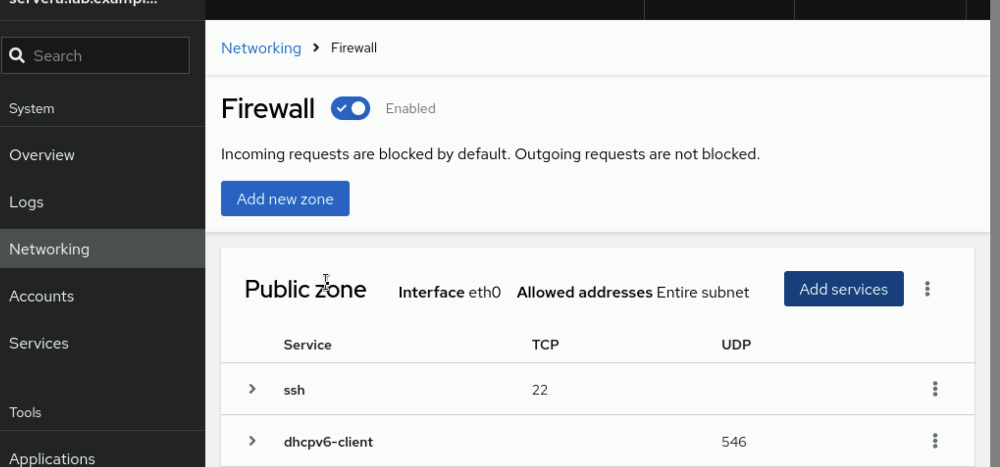
  - 네트워크 인터페이스 수정 가능
  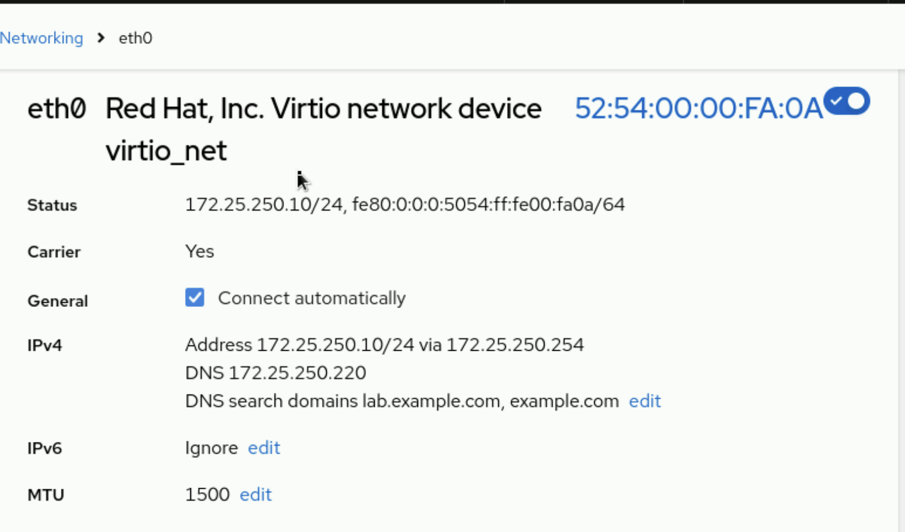

- 계정 설정 가능
  - 비밀번호 바꾸거나, 로그인 이력 보거나, ssh key 설정하는 등 다양한 작업 가능
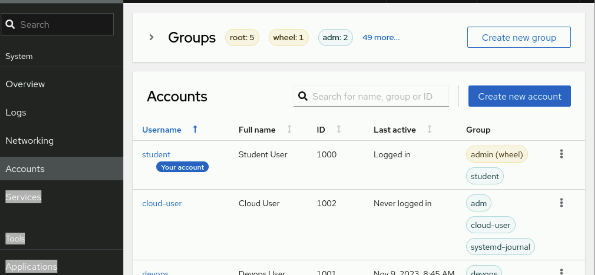

- 서비스 조회 및 설정 가능
  - log조회, config 관리, 서비스 관리 등 작업 가능
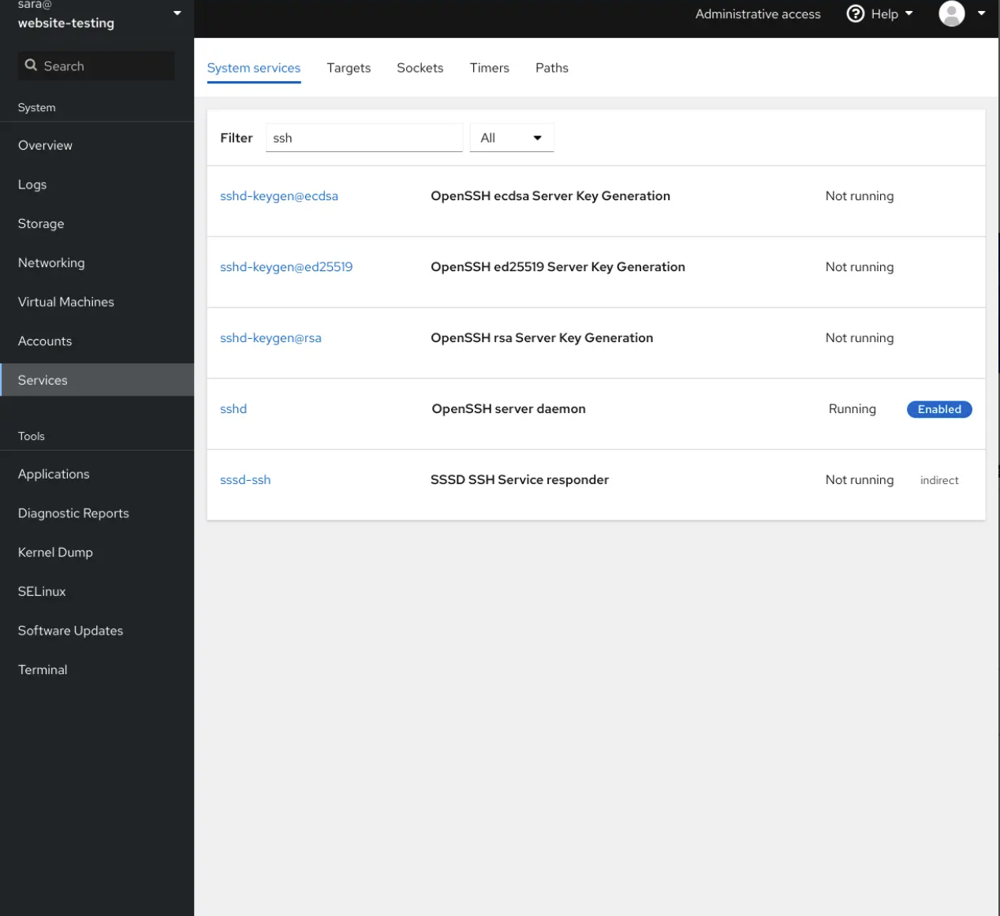
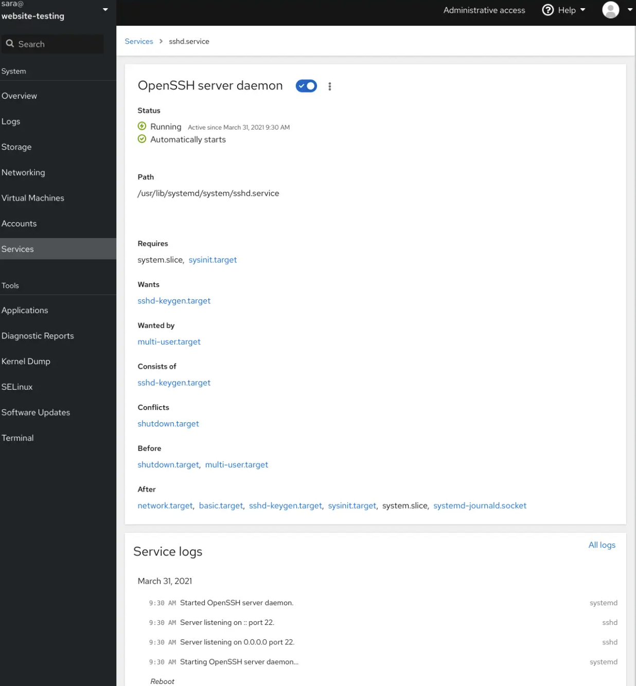

- 터미널 사용 가능
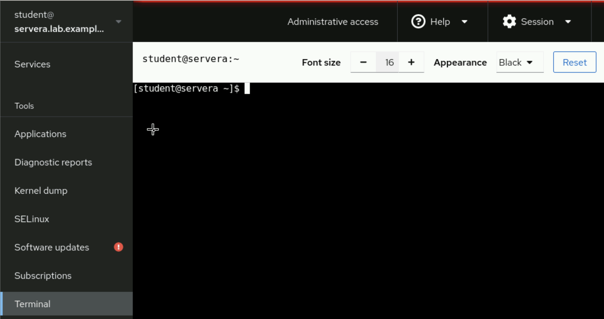
  
## with K8s?
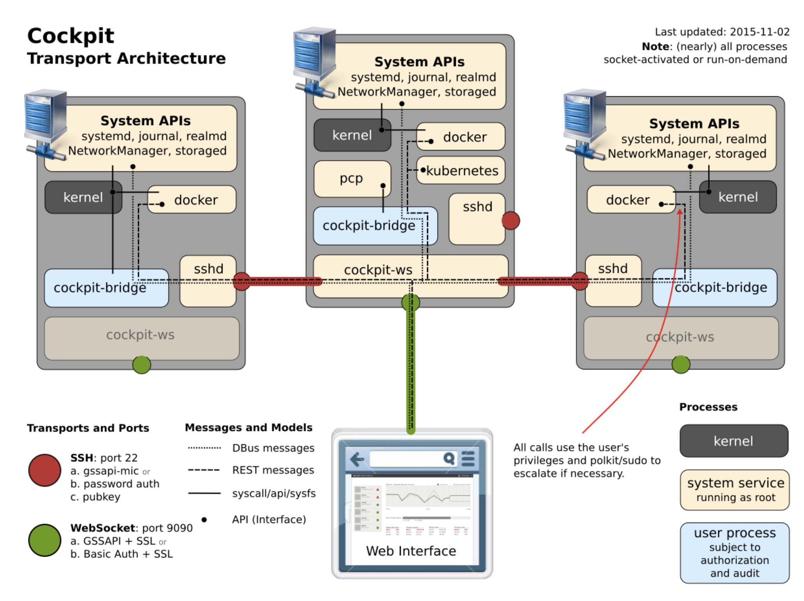

> **DBus(Desktop Bus)**는 리눅스 시스템에서 프로세스 간 통신(IPC, Inter-Process Communication)을 제공하는 메시지 기반 버스 시스템입니다
> 리눅스 시스템에서 실행 중인 프로세스들이 서로 통신하고, 명령을 주고받으며 상태를 공유할 수 있도록 도와줍니다.
> Cockpit은 DBus를 사용해 시스템의 상태를 읽거나 설정을 변경할 수 있습니다.


### 구성 요소
#### **1. System APIs**
- 각 시스템에서 다음 API에 접근 가능:
  - **systemd** → 서비스 및 프로세스 관리  
  - **journal** → 로그 관리  
  - **realmd** → 인증 및 도메인 관리  
  - **NetworkManager** → 네트워크 인터페이스 및 설정 관리  
  - **storaged** → 스토리지 관리  


#### **2. Cockpit Bridge (`cockpit-bridge`)**
- 사용자가 웹에서 보낸 요청을 시스템 레벨에서 처리  
- 사용자 권한을 기반으로 API 호출 수행  
- 필요한 경우 `sudo`를 통해 권한 상승 수행 가능  


#### **3. Cockpit WS (`cockpit-ws`)**
- 웹 인터페이스와 Cockpit Bridge 간의 연결 제공  
- **WebSocket (포트 9090)** 프로토콜 사용  
- 클라이언트에서 보낸 요청을 Cockpit Bridge에 전달  

#### **4. SSH (포트 22)**
- 원격 서버 관리 시 SSH를 통해 연결  
- 인증 방식:
  - **gssapi-mic(Kerberos 기반 보안)**  
  - **password auth**  
  - **public key**  
- 원격 시스템의 `sshd` 데몬과 통신  


### **Transport 및 Port**
| 프로토콜 | 포트 | 인증 방식 | 설명 |
|:---------|-------|-----------|-------|
| **SSH** | 22 | `gssapi-mic`, `password auth`, `public key` | SSH 연결을 통한 원격 접속 |
| **WebSocket** | 9090 | `GSSAPI + SSL`, `Basic Auth + SSL` | Cockpit 웹 인터페이스 연결 |


### **Messages and Models**
| 유형 | 설명 |
|-------|-------|
| **DBus messages** | 시스템의 DBus를 통해 서비스와 통신 |
| **REST messages** | RESTful API 메시지 전달 |
| **syscall/api/sysfs** | 시스템 호출 및 커널 상호 작용 |
| **API (Interface)** | Cockpit 인터페이스에서 처리하는 모든 호출 |


### **동작**
1. 사용자는 웹 브라우저에서 Cockpit 웹 인터페이스에 접근 (포트 9090)  
2. Cockpit WebSocket이 Cockpit Bridge에 연결  
3. Cockpit Bridge는 DBus 또는 시스템 API를 통해 커널/서비스에 명령 전달  
4. 필요 시 `sshd`를 통해 원격 서버에 접근  
5. 실행 결과가 Cockpit WebSocket을 통해 사용자에게 반환됨  

### 그래서 잘 쓸 수 있나?
- 설정 문서화 같은 거나 사용 케이스가 많아보이지는 않음
- 시스템 모니터링에 더 초점이 맞춰져있음
