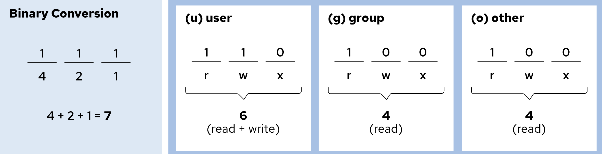
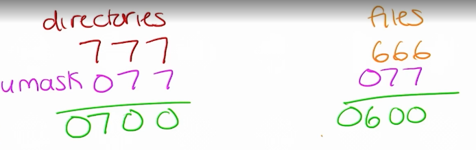

# 파일 액세스 제어
- 파일 권한을 파악하고 설정합니다.

## 파일 시스템 권한
- 파일 소유자 (owning user), 파일 소유 그룹 (owning group), 이외의 사용자에 대해 권한을 설정할 수 있다.
- 3가지 일반 권한(rwx) + 3가지 특수 권한으로 이루어짐
- 파일 타입은 일반 파일 또는 디렉터리가 될 수 있다
  - d: 디렉터리
  - l: 심볼릭 링크
  - c: 문자 장치 파일 (`crw-rw-rw- 1 root root 1, 3 Feb 10 10:00 /dev/null
`)
  - b: 블록 장치 파일 (`brw-rw---- 1 root disk 8, 0 Feb 10 10:00 /dev/sda`)
  - p: 프로세스 간 통신을 위한 특수 파일 (`prw-r--r-- 1 user user 0 Feb 10 10:00 mypipe`)
  - s: 소켓 (`srwxrwxrwx 1 user user 0 Feb 10 10:00 mysocket`)
- 총 10가지 bit로 표현 `{파일 타입}{owning user rwx}{owning group rwx}{other rwx}`
  - `ls -l`로 조회 가능 `-d` 옵션으로 디렉터리 권한도 확인 가능
  - `-rw-r--r--`: 일반 파일, global read, only owning user can edit
  - `drwxr-xr-x. 5 root root 4096 Feb 31 22:00 /home`: 파일 권한 / 하드링크 수 / owning user / owning group / file size / 생성일자 / 대상 파일
- 파일 타입별 권한
  - 디렉터리
    - read(r): 디렉터리 내용(파일 이름)을 조회할 수 있음
    - write(w): 디렉터리에 임의 파일을 생성하거나 삭제할 수 있음
    - execute(x): 디렉터리를 현재 작업 디렉터리로 설정할 수 있음(`cd`, `find`)
  - 파일
    - read(r): 파일 내용을 읽을 수 있음
    - write(w): 파일 내용 변경 가능
    - execute(x): 파일 실행 가능
- example(dir)
  - `ls`: 접근(x)+조회(r)
  - `cd`: 접근(x)
  - `touch`/`rm`: **변경(w)** 파일 권한이 없어도 실행 가능
- 권한 확인 순서
  1. owning user인가
  2. owning group인가
  3. other 적용
- Quiz. example. 권한이 -wxrwxrwx user1:user1 인 경우 user1은 파일을 읽을 수 있는가?

## 명령줄에서 파일 시스템 권한 관리
### 파일 및 디렉터리 권한 변경
- chmod로 변경
  - permission bit
  
  - `chmod 770 my_file`: owning user, owning group에게 rwx권한, other는 권한 없음
  - `chmod g+x my_file`: owning group에 실행 권한 추가
  - `chmod a+r my_file`: owning user, owning group, others에 모두 읽기 권한 추가
  - `[root@host opt]# chmod -R g+rwX demodir`: `demodir/` 내부에 있는 디렉터리는 실행 권한이 부여되지만 일반 파일은 기존에 실행 권한이 없다면 반영되지 않음
    - before
    ```bash
    drwxr-xr-- demodir/            # 디렉터리
    -rw-r--r-- normal.txt          # 일반 텍스트 파일
    -rwxr--r-- script.sh           # 실행 권한이 있는 스크립트
    ```
    - after
    ```bash
    drwxrwxr-- demodir/            # 디렉터리 - 그룹에 w,x 권한 추가
    -rw-rw-r-- normal.txt          # 일반 파일 - 그룹에 w 권한만 추가
    -rwxrwxr-- script.sh           # 실행 파일 - 그룹에 w,x 권한 추가
    ```
  - `chmod go-rw document.pdf`: 그룹 및 기타의 읽기 및 쓰기 권한을 제거

### 파일 및 디렉터리 사용자 또는 그룹 소유권 변경
- 일반적으로 파일의 생성자가 파일을 소유함. 파일의 그룹 소유권은 생성자의 기본 그룹으로 설정
- chown
  - `chown -R student Pictures`:  디렉터리 트리의 소유권을 재귀적으로 변경
  - `chown :admins Pictures`: 그룹 소유권을 admins로 변경
- chgrp
  - `chgrp developers myfile.txt`: 그룹 소유권 변경

## 기본 권한 및 파일 액세스 관리
### 특수 권한
- sticky bit
  - only directory
  - directory 내 파일에 대해 오직 owning user만이 삭제할 수 있음
  - `ls -l` 명령어에서 기타 사용자(others)의 실행 권한 위치에 t/T로 표시됩니다
    - t: other 실행 권한이 있는 경우
    - T: other 실행 권한이 없는 경우
  - 권한은 제일 앞에 1(ex. 1777)
  - `chmod +t directory` or `chmod 1777 directory`
  - 소유자가 아닌 user가 삭제 시도시 `Permmision denied` 에러가 아닌 `Operation not permitted` 
- setGid
  - file, directory 모두 적용 가능
  - file
    - 파일을 소유한 그룹 권한으로 실행
    - "실행할 때 그룹 권한을 유지"하는 것이지, 실행 권한을 부여하는 게 아님
  - directory
    - 새롭게 생성된 파일의 그룹이 해당 파일이 만들어진 디렉터리의 그룹을 따라감
    - 일반적으로 공유 디렉터리에서 특정 그룹을 유지하기 위해 사용됨
  - `ls -l` 명령어에서 그룹 사용자(owning group)의 실행 권한 위치에 s/S로 표시됩니다 
  - 권한은 제일 앞에 2(ex. 2777)
    - **주의**: 기존에 1777로 설정되었다면 sticky bit 설정이 지워짐. 둘 다 유지하고 싶다면 3777로 설정 필요
  - `chmod g+s`: setGid 설정
- setUid
  - only file
  - file이 실행가능할 때 소유자의 권한으로 실행
  - 일반 사용자가 root 권한이 필요한 명령 실행
    - 예: passwd 명령어
    -  passwd 명령어는 일반 사용자가 자신의 비밀번호를 변경할 때 사용되지만, 실제로는 /etc/shadow 파일을 수정해야 함
    - /etc/shadow는 root 권한이 있어야 수정할 수 있기 때문에, passwd 명령어는 setuid가 설정되어 있음
  - `ls -l` 명령어에서 소유 사용자(owning user)의 실행 권한 위치에 s/S로 표시됩니다 
  - 권한은 제일 앞에 4(ex. 4777)
  ```bash
  ls -l /usr/bin/passwd
  -rwsr-xr-x 1 root root 54256 Feb 9 12:00 /usr/bin/passwd
  ```

### 기본 파일 권한
- 기본으로 directory는 777, file은 666 권한을 가짐 
- umask로 기본 권한을 변경할 수 있음
  
- umask 조회
    ```bash
    [user@host ~]$ umask
    0022
    ```
- `umask` cmd를 사용해 현재 세션에 적용하거나 Bash 쉘 사용자의 시스템 기본 umask 값이 정의되어있는 /etc/login.defs 파일과 /etc/bashrc 파일 수정 가능. 
- user level로 설정하고 싶다면 홈 디렉터리의 .bash_profile 또는 .bashrc 파일에서 시스템 기본값을 재정의 가능