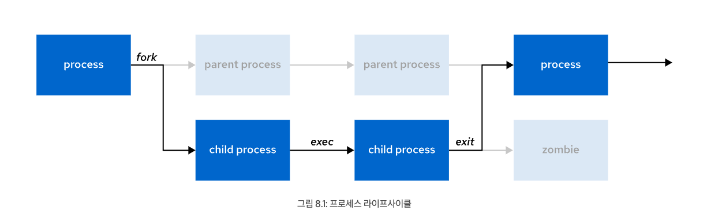
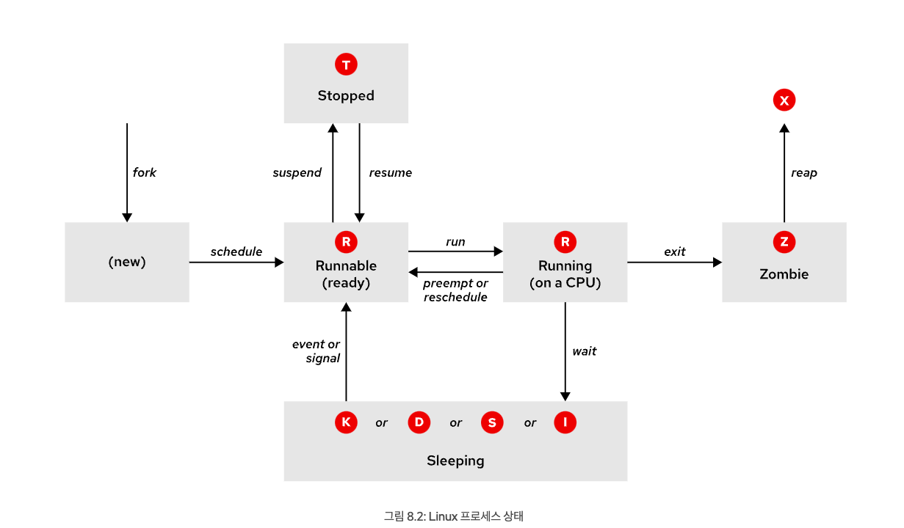

# Linux 프로세스 모니터링 및 관리

## 프로세스 상태 및 라이프사이클

시스템에서 실행중인 프로그램의 상태, 리소스 사용, 소유권을 확인하여 제어할 수 있다.

### 프로세스란?

- 시작되어 실행 가능한 프로그램의 실행 인스턴스
- 프로세스는 생성된 순간부터 다음 항목으로 구성된다.
  - 할당된 메모리의 주소 공간
  - 소유권 자격 증명 및 권한을 비롯한 보안 등록 정보
  - 하나 이상의 프로그램 코드 실행 스레드
  - 프로세스 상태
- 프로세스의 **환경**은 다음 항목을 말함
  - 로컬 및 전역 변수
  - 현재 스케줄링 컨텍스트
  - 파일 설명자, 네트워크 포트 등의 할당된 시스템 리소스
- 프로세스는 하위 프로세스를 생성할 수 있음
  - 모든 프로세스는 Red Hat 시스템의 첫 번째 시스템 프로세스인 `systemd`의 하위 프로세스임
  - *상위* 프로세스는 자체 주소 공간(*포크*라고 함)을 복제하여 *하위* 프로세스 구조를 생성함
  - 모든 새 프로세스에는 고유한 PID(*프로세스 ID*)가 할당됨



- 상위 프로세스와 하위프로세스의 동작 구조
  - 일반적으로 상위 프로세스는 하위 프로세스가 실행되는 동안 *유휴 상태* 가 되고,  하위 프로세스가 완료되면 신호를 받는 *대기* 요청을 설정
  - 하위 프로세스는 종료된 후 해당 리소스와 환경을 닫거나 삭제하고 프로세스 표의 항목인 *좀비* 리소스를 남김
  - 하위 프로세스가 종료될 때 *유휴 상태 해제* 신호를 받는 상위 프로세스는 프로세스 표에서 하위 프로세스 항목을 정리하고 하위 프로세스의 마지막 리소스를 해제

### 프로세스 상태



| 이름   | 플래그 | 설명                                                         |
| ------ | ------ | ------------------------------------------------------------ |
| 실행   | R      | TASK_RUNNING:프로세스가 CPU에서 실행 중이거나 실행을 기다리고 있음 |
| 수면   | S      | TASK_INTERRUPTIBLE: 프로세스가 하드웨어 요청, 시스템 리소스 액세스, 신호 등 일부 조건을 기다림<br />이벤트 또는 신호가 조건을 만족하면 프로세스는 *Running* 상태로 복귀함 |
| 수면   | D      | TASK_UNINTERRUPTIBLE: 이 프로세스도 유휴 상태지만 `S` 상태와 달리 신호에 응답하지 않음<br />프로세스 중단 시 예기치 않은 장치 상태가 발생할 수 있는 경우(주로 I/O 작업 등)에만 사용 |
| 수면   | K      | TASK_KILLABLE: 중단되지 않는 `D` 상태와 동일하지만, 대기 중인 작업이 강제 종료(완전히 종료) 신호에 응답할 수 있도록 수정<br />유틸리티에서 *강제 종료 가능한* 프로세스를 `D` 상태로 표시하는 경우가 많음 |
| 수면   | I      | TASK_REPORT_IDLE: `D` 상태의 하위 집합. 커널은 부하 평균을 계산할 때 이러한 프로세스를 카운트하지 않음 |
| 중지   | T      | TASK_STOPPED: 일반적으로 사용자 또는 다른 프로세스의 신호를 받아 프로세스가 중지(일시 중단)됨<br />다른 신호를 통해 프로세스가 계속(재개)되어 실행 중 상태로 돌아갈 수 있음 |
| 중지   | T      | TASK_TRACED: 디버그 중인 프로세스도 일시적으로 중지되며 `T` 상태 플래그를 공유 |
| Zombie | Z      | TASK_ZOMBIE: 하위 프로세스가 종료될 때 상위 프로세스에 신호를 보냄<br />프로세스 ID(PID)를 제외한 모든 리소스가 릴리스됨 |
| Zombie | X      | TASK_DEAD: 상위 프로세스가 나머지 하위 프로세스 구조를 클린업(리프)하면 프로세스는 완전히 릴리스된 상태<br />이 상태는 프로세스 목록 유틸리티에서 관찰할 수 없음 |


```
[user@host ~]$ top
PID USER  PR  NI    VIRT    RES    SHR S  %CPU  %MEM   TIME+    COMMAND
2259 root 20   0  270856  40316   8332 S   0.3   0.7   0:00.25  sssd_kcm
   1 root 20   0  171820  16140  10356 S   0.0   0.3   0:01.62  systemd
   2 root 20   0       0      0      0 S   0.0   0.0   0:00.00  kthreadd
...output omitted...
```

```
[user@host ~]$ ps aux
USER       PID %CPU %MEM    VSZ   RSS TTY      STAT START   TIME COMMAND
...output omitted...
root         2  0.0  0.0      0     0 ?        S    11:57   0:00 [kthreadd]
student   3448  0.0  0.2 266904  3836 pts/0    R+   18:07   0:00 ps aux
...output omitted...
```

- top 명령의 S열 또는 PS 명령의 STAT열에 각 프로세스의 상태가 표시됨

## 작업 제어

Bash 작업 제어를 사용하여 동일한 터미널 세션에서 시작된 여러 프로세스를 관리할 수 있다.

- 일반적으로 하나의 작업만 특정 터미널 창에서 입력 및 키보드로 생성된 신호를 읽을 수 있다.
  - 제어 터미널의 foreground 프로세스임
- *백그라운드* 프로세스는 터미널과 연결된 다른 작업을 말함
  -  터미널의 백그라운드 프로세스는 터미널에서 입력을 읽거나 키보드로 생성된 인터럽트를 수신할 수는 없지만 터미널에 쓸 수 있음

```shell
# 명령에 앰퍼샌드(&)를 추가하면 백그라운드에서 프로세스를 시작
[user@host ~]$ sleep 10000 &
[1] 5947

# 쉘 세션의 작업 목록 조회
[user@host ~]$ jobs
[1]+ Running    sleep 10000 &

# fg 명령으로 백그라운드 작업을 포그라운드로 가져옴
# fg %jobNumber
[user@host ~]$ fg %1
sleep 10000

# foreground 실행중인 작업의 일시중지(ctrl+z)
[user@host ~]$ sleep 10000
^Z
[1]+  Stopped                 sleep 10000

# 프로세스 작업에 대한 정보 조회, 상태 T(Stopped)
[user@host ~]$ ps j
 PPID   PID  PGID   SID TTY      TPGID STAT   UID   TIME COMMAND
 2764  2768  2768  2768 pts/0     6377 Ss    1000   0:00 /bin/bash
 2768  5947  5947  2768 pts/0     6377 T     1000   0:00 sleep 10000
 2768  6377  6377  2768 pts/0     6377 R+    1000   0:00 ps j

# bg 명령에 작업 ID를 사용해 일시 중단된 프로세스의 실행 시작
[user@host ~]$ bg %1
[1]+ sleep 10000 &
```


## 프로세스 강제 종료

명령을 사용하여 프로세스를 강제 종료 및 통신하고 데몬 프로세스의 특성을 정의하고, 사용자 세션 및 프로세스를 중지할 수 있다.

### 신호를 사용한 프로세스 제어

- Signal이란?
  - 프로세스에 전달된 소프트웨어 인터럽트
  - 신호를 생성하는 이벤트는 오류나 외부 이벤트(I/O 요청 또는 타이머 만료)일 수도 있고, 신호 전송 명령 또는 키보드 시퀀스의 명시적 사용에 의해 발생할 수도 있음

| 신호        | 이름 | 정의                                                         |
| ----------- | ---- | ------------------------------------------------------------ |
| 1           | HUP  | `Hangup` : 터미널의 제어 프로세스 종료를 보고<br /> 프로세스를 종료하지 않고 재초기화(구성 재로드)하도록 요청 |
| 2           | INT  | `Keyboard interrupt` : 프로그램이 종료<br />차단하거나 처리할 수 있음.<br />INTR(인터럽트) 키 시퀀스(**Ctrl**+**c**)를 눌러 전송 |
| 3           | QUIT | `Keyboard quit` : SIGINT와 유사하며 종료할 때 프로세스 덤프를 추가<br />QUIT 키 시퀀스(**Ctrl+\**)를 눌러 전송 |
| 9           | KILL | `Kill, unblockable` : 갑작스럽게 프로그램이 종료됩니다. 차단, 무시 또는 처리할 수 없음 |
| 15(default) | TERM | `Terminate` : 프로그램이 종료됩니다. SIGKILL과 달리 차단, 무시 또는 처리할 수 있음<br />프로그램이 종료되도록 요청하는 "깔끔한" 방법<br />프로그램이 종료되기 전에 필수 작업 및 자체 정리를 완료할 수 있음 |
| 18          | CONT | `Continue` : 프로세스가 중지된 경우 재개하기 위해 전송, 차단할 수 없음 |
| 19          | STOP | `Stop, unblockable` : 프로세스를 일시 중지합니다. 차단할 수 없음 |
| 20          | TSTP | Keyboard stop: SIGSTOP와 달리 차단, 무시 또는 처리할 수 있음<br />일시 중단 키 시퀀스(**Ctrl**+**z**)를 눌러 전송 |

```shell
# 신호 조회
[user@host ~]$ kill -l
 1) SIGHUP      2) SIGINT      3) SIGQUIT     4) SIGILL      5) SIGTRAP
 6) SIGABRT     7) SIGBUS      8) SIGFPE      9) SIGKILL    10) SIGUSR1
11) SIGSEGV    12) SIGUSR2    13) SIGPIPE    14) SIGALRM    15) SIGTERM
16) SIGSTKFLT  17) SIGCHLD    18) SIGCONT    19) SIGSTOP    20) SIGTSTP
...output omitted...

# job 이름 프로세스 조회
[user@host ~]$ ps aux | grep job
5194 0.0 0.1 222448 2980 pts/1 S  16:39 0:00 /bin/bash /home/user/bin/control job1
5199 0.0 0.1 222448 3132 pts/1 S  16:39 0:00 /bin/bash /home/user/bin/control job2
5205 0.0 0.1 222448 3124 pts/1 S  16:39 0:00 /bin/bash /home/user/bin/control job3
5430 0.0 0.0 221860 1096 pts/1 S+ 16:41 0:00 grep --color=auto job

# 5194 process TERM
[user@host ~]$ kill 5194
[user@host ~]$ ps aux | grep job
user   5199  0.0  0.1 222448  3132 pts/1    S    16:39   0:00 /bin/bash /home/user/bin/control job2
user   5205  0.0  0.1 222448  3124 pts/1    S    16:39   0:00 /bin/bash /home/user/bin/control job3
user   5783  0.0  0.0 221860   964 pts/1    S+   16:43   0:00 grep --color=auto job
[1]   Terminated              control job1

# 5199 process KILL
[user@host ~]$ kill -9 5199
[user@host ~]$ ps aux | grep job
user   5205  0.0  0.1 222448  3124 pts/1    S    16:39   0:00 /bin/bash /home/user/bin/control job3
user   5930  0.0  0.0 221860  1048 pts/1    S+   16:44   0:00 grep --color=auto job
[2]-  Killed                  control job2

# 5205 process KILL
[user@host ~]$ kill -SIGTERM 5205
user   5986  0.0  0.0 221860  1048 pts/1  S+  16:45  0:00 grep --color=auto job
[3]+  Terminated              control job3
```


### 특정 프로세스 제어

- pkill 명령으로 선택 기준에 맞는 하나 이상의 프로세스에 신호 전송
- 선택 기준은 명령의 이름, 소유 사용자 등이 될 수 있음
- prep 명령을 사용해 강제 종료할 PID 확인할 수 있음

```shell
# bob 소유 프로세스 조회
[root@host ~]# pgrep -l -u bob
6964 bash
6998 sleep
6999 sleep
7000 sleep

# bob 소유 프로세스 KILL
[root@host ~] pkill -SIGKILL -u bob
[root@host ~] pgrep -l -u bob
```


- killall 명령으로 여러 프로세스에 신호 보낼 수 있음
  - 명령 이름을 기반으로 여러 프로세스에 신호를 보낼 수 있음

```shell
[user@host ~]$ ps aux | grep job
5194  0.0  0.1 222448  2980 pts/1    S    16:39   0:00 /bin/bash /home/user/bin/control job1
5199  0.0  0.1 222448  3132 pts/1    S    16:39   0:00 /bin/bash /home/user/bin/control job2
5205  0.0  0.1 222448  3124 pts/1    S    16:39   0:00 /bin/bash /home/user/bin/control job3
5430  0.0  0.0 221860  1096 pts/1    S+   16:41   0:00 grep --color=auto job

# control 명령을 갖는 프로세스 종료
[user@host ~]$ killall control
[1]   Terminated              control job1
[2]-  Terminated              control job2
[3]+  Terminated              control job3
[user@host ~]$
```


## 프로세스 활동 모니터링

- 부하 평균을 정의하고 리소스를 많이 사용하는 서버 프로세스를 확인할 수 있음


### 부하 평균 설명

- *부하 평균* 은 일정 기간 동안 인식된 시스템 부하를 나타내기 위해 Linux 커널에서 제공하는 측정값
- 커널은 실행 가능 및 무중단 상태의 프로세스 수를 기준으로 5초마다 현재 부하 수치를 수집함
-  이 숫자는 누적되어 가장 최근의 1분, 5분, 15분 동안 지수 이동 평균으로 보고됨


### 부하 평균 계산

- 부하 수치는 실행할 준비가 되고(프로세스 상태 `R`) 완료할 I/O에 대해 대기 중인(프로세스 상태 `D`) 프로세스의 평균 실행 수
- Linux는 디스크 또는 네트워크 사용률도 포함함
  -  CPU 부하만큼 시스템 성능에 큰 영향을 미칠 수 있기 때문

```shell
# 부하 평균에 대한 세 개의 값은 마지막 1분, 5분, 15분에 대한 부하
[user@host ~]$ uptime
 15:29:03 up 14 min,  2 users,  load average: 2.92, 4.48, 5.20
 
# lscpu 명령을 사용하여 시스템에 있는 CPU 수를 확인
# 시스템은 코어당 두 개의 하이퍼스레드가 있는 듀얼 코어 단일 소켓 시스템
# Linux는 이 CPU 구성을 스케줄링 목적의 4개 CPU 시스템으로 취급함
[user@host ~]$ lscpu
Architecture:        x86_64
CPU op-mode(s):      32-bit, 64-bit
Byte Order:          Little Endian
CPU(s):              4
On-line CPU(s) list: 0-3
Thread(s) per core:  2
Core(s) per socket:  2
Socket(s):           1
NUMA node(s):        1
...output omitted...

# From lscpu, the system has four logical CPUs, so divide by 4:
#                               load average: 2.92, 4.48, 5.20
#           divide by number of logical CPUs:    4     4     4
#                                             ----  ----  ----
#                       per-CPU load average: 0.73  1.12  1.30
#
# This system's load average appears to be decreasing.
# With a load average of 2.92 on four CPUs, all CPUs were in use ~73% of the time.
# During the last 5 minutes, the system was overloaded by ~12%.
# During the last 15 minutes, the system was overloaded by ~30%.

# 부하 평균 값을 시스템의 논리적 CPU 수로 나눠볼 수 있음
# 값이 1 미만이면 적절한 리소스 사용량과 최소 대기 시간을 나타냄
# 값이 1보다 크면 리소스 포화와 어느 정도의 처리 지연을 나타냄
```


### 실시간 프로세스 모니터링

- `top` 명령은 시스템 프로세스의 동적 뷰 및 요약 헤더와 프로세스 또는 스레드 목록을 차례로 표시
  - 정적 `ps` 명령 출력과는 달리, `top` 명령은 구성 가능한 간격마다 계속해서 새로 고치고 열 순서 변경, 정렬, 강조 표시 기능을 제공


| 키                     | 목적                                                         |
| :--------------------- | :----------------------------------------------------------- |
| **?** *or* **h**       | 대화형 키 입력 도움말.                                       |
| **l**, **t**, **m**    | 부하, 스레드 및 메모리 헤더 라인을 전환합니다.               |
| **1**                  | 헤더에 개별 CPU 또는 모든 CPU 요약을 표시하는 토글입니다.    |
| **s**                  | 새로 고침(화면) 속도를 소수 초 단위(예: 0.5, 1, 5)로 변경합니다. |
| **b**                  | `Running` 프로세스에 대한 반전 강조 표시를 전환합니다. 기본값은 굵은 글꼴입니다. |
| **Shift**+**b**        | 디스플레이, 헤더, *실행 중* 인 프로세스에 굵은 글꼴을 사용하도록 설정합니다. |
| **Shift**+**h**        | 스레드를 전환합니다. 프로세스 요약 또는 개별 스레드를 표시합니다. |
| **u**, **Shift**+**u** | 사용자 이름으로 필터링합니다(유효, 실제).                    |
| **Shift**+**m**        | 메모리 사용량에 따라 프로세스 목록을 내림차순으로 정렬합니다. |
| **Shift**+**p**        | 프로세서 사용량에 따라 프로세스 목록을 내림차순으로 정렬합니다. |
| **k**                  | 프로세스를 종료합니다. 메시지가 표시되면 `PID`, `signal`를 차례로 입력합니다. |
| **r**                  | 프로세스 우선 순위를 변경합니다. 메시지가 표시되면 `PID`, `nice_value`를 차례로 입력합니다. |
| **Shift**+**w**        | 다음에 `top`을 다시 시작할 때 사용할 현재 디스플레이 구성을 작성(저장)합니다. |
| **q**                  | 종료                                                         |
| **f**                  | 필드를 활성화 또는 비활성화하여 열을 관리합니다. `top`의 정렬 필드를 설정할 수도 있습니다. |
