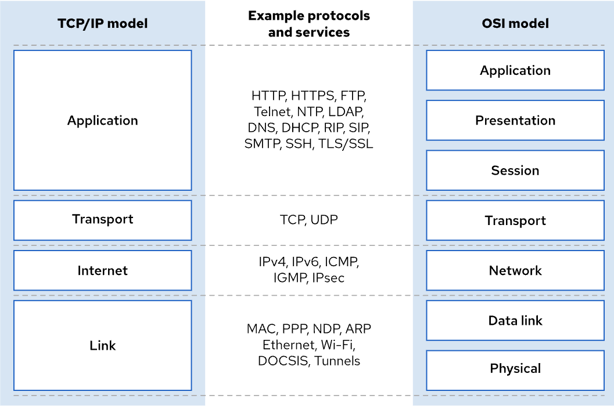
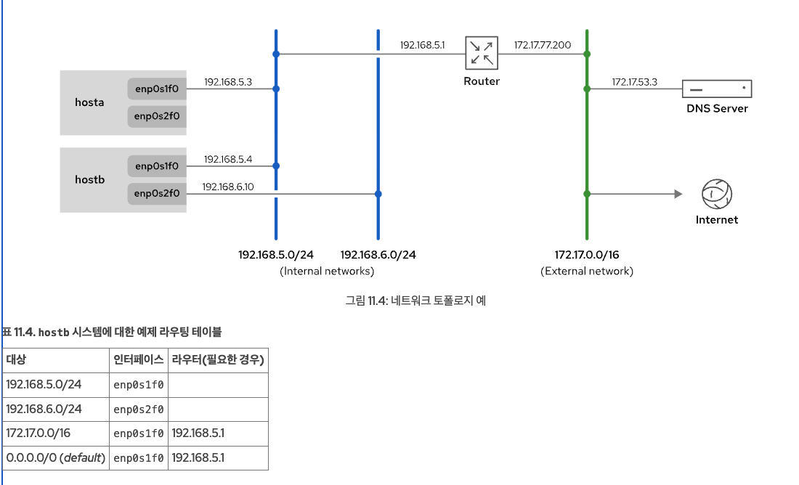
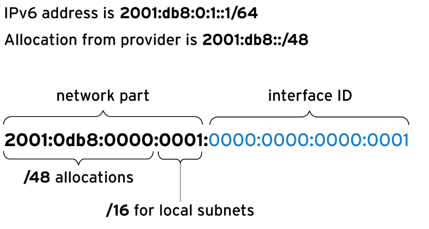
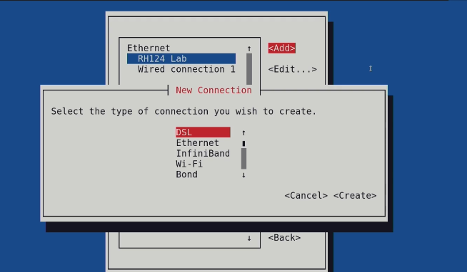

# TCP/IP 네트워크 모델

- 애플리케이션 layer
  - 애플리케이션에 맞는 통신 구성
  - SSH, HTTPS, FTP, SMTP
- Transport layer
  - 데이터 전송 프로토콜
  - 포트 번호 할당
  - TCP(신뢰할 수 있는 연결 지향 통신), UDP(비 연결 지향적인 데이터그램 프로토콜)
- Internet layer
  - 소스 호스트의 데이터를 타겟 호스트로 전달
  - IPv4, IPv6 프로토콜 사용
- Link layer(Datalink + physical)
  - 물리 미디어에 대한 연결
  - mac addr 로 데이터 전송

## 네트워크 인터페이스 이름
- 이전 버전의 Red Hat Enterprise Linux에서는 eth0, eth1 같은 이름을 사용했음
- 운영 체제에서 탐지한 순서대로 이름을 붙임
- 장치 추가 제거에 있어 예기치 않게 이름이 변경될 수 있어 적절하지 않음

- Red Hat Enterprise Linux 7 이상에서는 기본 이름 지정 시스템이 재부팅 후에도 유지되는 이름을 생성
- 이더넷, WLAN, WWAN 등 인터페이스에 맞게 네이밍
  - 이더넷: 유선 네트워크 연결 방식 (en)
  - WLAN: wifi (wl)
  - WWLAN: 셀룰러 네트워크  (ww)
- 인터페이스에 맞는 프리픽스 + 장치 설정을 합쳐 네이밍

## IPv4 네트워크
- 32bit로 구성, 0~255 사이의 값이 '.' 로 구분되어 4개 숫자로 표현
  - 10.0.0.1
- 네트워크 부분과 호스트 부분으로 나뉨
- 네트워크 부분으로 고유한 서브넷 구성
- 호스트 부분으로 특정 호스트를 식별
- 네트워크 부분은 CIDR 표기법으로(슬래시로 구분) 표기할 수 있음

## IPv4 네트워크 마스크
- '/24' 같이 네트워크 접두사가 붙는 경우 서브넷에 8비트가 남게됨 호스트 가능 주소는 255개
- 네트워크 주소: 호스트 번호가 모두 0
- 브로드캐스트 주소: 호스트 번호가 모두 1, 모든 서브넷 호스트에 패킷을 브로드 캐스트
- 일반적으로 게이트웨이 주소가 첫 번쨰 호스트 주소로 사용됨
- 예시: 172.16.181.23/19

| 항목 | 값 | 2진수 표현 |
|------|--------------------------|----------------------------------|
| **네트워크 접두사** | /19 또는 255.255.224.0 | `11111111.11111111.11100000.00000000` |
| **호스트 주소** | 172.16.181.23 | `10101100.00010000.10110101.00010111` |
| **네트워크 주소** | 172.16.160.0 | `10101100.00010000.10100000.00000000` |
| **서브넷의 호스트 주소 범위** | 172.16.160.1 ~ 172.16.191.254 | `10101100.00010000.10100000.00000001` ~ `10101100.00010000.10111111.11111110` |
| **브로드캐스트 주소** | 172.16.191.255 | `10101100.00010000.10111111.11111111` |

## IPv4 경로
- 네트워크 패킷은 서브넷의 호스트 간에 이동하고, 라우터를 통해 네트워크 간에 이동
- 각 호스트에는 특정 네트워크에 패킷을 보낼 때 어떤 네트워크 인터페이스를 사용해야 하는지 결정하는 라우팅 표 존재
- 라우팅 표에는 대상 네트워크, 사용할 네트워크 인터페이스, 최종 대상까지 패킷을 전달하는 라우터의 IP 주소 등의 항목 존재

- hostb 시스템에서 192.168.6.0/24 네트워크의 호스트로 이동하는 네트워크 트래픽은 enp0s2f0 인터페이스를 통해 직접 전송
- hostb 시스템에서 IP 주소가 172.17.50.120 인 호스트로 이동하는 네트워크 트래픽은 트래픽이 라우팅 표의 세 번째 항목과 일치하므로 enp0s1f0 인터페이스를 사용
- 타겟이 라우팅 표의 항목과 일치하지 않는 네트워크 트래픽은 기본 경로로 전송됩니다. 0.0.0.0/0으로 지정된 기본 경로는 네 번째 항목에 표시

## IPv4 주소 및 경로 구성
- 서버는 DHCP 서버와 통신하여 IPv4 네트워크 설정을 자동으로 구성
  - 일반적으로 가정에서 사용하는 Wi-Fi 공유기가 기본적으로 DHCP 서버 역할을 수행
- 네트워크에 연결된 장치(클라이언트)에게 IP 주소와 네트워크 설정을 자동으로 할당

## IPv6 네트워크
- IPv6는 더 많은 비트를 사용해 사용 가능한 총 장치 주소 수를 크게 확장하도록 설계
- IPv6 주소는 일반적으로 16진수 니블 4개 그룹 8개가 콜론으로 구분되어 표시되는 128비트 숫자입니다. 각 니블은 IPv6 주소 4비트를 나타내므로 각 그룹은 IPv6 주소 16비트를 나타냄
- ex. `2001:0db8:0000:0010:0000:0000:0000:0001`(=`2001:db8:0:10::1`)
- 주소에 길이가 같은 연속된 0 그룹이 2개 있는 경우 각 그룹의 맨 왼쪽에 있는 0 그룹은 :: 으로, 맨 오른쪽에 있는 그룹은 :0: 으로 짧게 줄입니다.
- IPv6 주소 다음에 TCP 또는 UDP 네트워크 포트를 포함할 경우 항상 IPv6 주소를 대괄호로 묶어 포트가 주소의 일부처럼 보이지 않도록 합니다.
  - `[2001:db8:0:10::1]:80`

## IPv6 서브넷
- 일반 IPv6 유니캐스트 주소는 네트워크 접두사와 인터페이스 ID의 두 부분으로 나누짐
- 네트워크 접두사는 서브넷을 식별합니다. 동일한 서브넷의 두 네트워크 인터페이스가 동일한 인터페이스 ID를 보유할 수는 없음
- 인터페이스 ID는 서브넷의 특정 인터페이스를 식별
- IPv6에는 거의 모든 일반 주소에 사용되는 표준 서브넷 마스크 /64
- 네트워크 프로바이더는 조직에 더 짧은 접두사(예: /48)를 할당할 수 있음. 이 네트워크 부분의 나머지는 할당된 접두사의 서브넷(최대 /64 길이까지)을 할당하는 데 사용할 수 있음


| IPv6 주소 또는 네트워크 | 목적 | 설명 |
|-------------------|-----------------|----------------------------------------------------------|
| `::1/128` | localhost | 127.0.0.1/8 주소에 해당하는 IPv6 주소로, 루프백 인터페이스에서 설정됩니다. |
| `::` | 지정되지 않은 주소 | 0.0.0.0에 해당하는 IPv6 주소입니다. 네트워크 서비스의 경우 구성된 모든 IP 주소에서 수신 대기함을 나타낼 수 있습니다. |
| `::/0` | 기본 경로(IPv6 인터넷) | 0.0.0.0/0 주소에 해당하는 IPv6 주소입니다. 라우팅 테이블의 기본 경로가 이 네트워크와 일치합니다. 이 네트워크의 라우터는 더 나은 경로가 없는 모든 트래픽이 전송되는 위치입니다. |
| `2000::/3` | 글로벌 유니캐스트 주소 | 현재 IANA(Internet Assigned Numbers Authority)는 이 공간에서 "일반" IPv6 주소를 할당합니다. 이 주소에는 `2000::/16 ~ 3fff::/16` 사이의 모든 네트워크가 포함됩니다. IPv4 공인 IP 주소같은 개념 |
| `fd00::/8` | 고유한 로컬 주소 (RFC 4193) | 네트워크 범위가 가깝긴 하지만, IPv6에는 RFC 1918 개인 주소 공간에 직접 해당하는 공간이 없습니다. 사이트에서는 이러한 네트워크를 사용해서 조직 내에서 전용 라우팅 가능한 주소 공간을 자체적으로 할당할 수 있습니다. 그러나 이러한 네트워크는 글로벌 인터넷에서 사용할 수 없습니다. 사이트는 이 공간에서 `/48`을 무작위로 선택해야 하지만, 일반적으로 해당 할당 내용을 서브넷으로 `/64` 네트워크에 연결할 수 있습니다. 사설 IP 주소(예: 192.168.x.x, 10.x.x.x, 172.16.x.x ~ 172.31.x.x) |
| `fe80::/10` | 링크-로컬 주소 | 모든 IPv6 인터페이스는 `fe80::/64` 네트워크의 로컬 링크에서만 작동하는 링크-로컬 유니캐스트 주소를 자동으로 구성합니다. 그러나 전체 `fe80::/10` 범위는 나중에 로컬 링크에서 사용할 수 있도록 예약되어 있습니다. 이 주제에 대해서는 나중에 자세히 설명합니다. |
| `ff00::/8` | 멀티캐스트 | 224.0.0.0/4 주소에 해당하는 IPv6 주소입니다. 멀티캐스트는 동시에 여러 호스트에 전송하는 데 사용되며, 브로드캐스트 주소가 없음으로 IPv6에서 특히 중요합니다. |

- IPv4와 유사하게, 고정 IPv6 주소에 사용할 인터페이스 ID를 선택할 수 있습니다. IPv4에서 네트워크의 주소 2개는 사용할 수 없습니다. 가장 낮은 주소는 네트워크 주소이고, 가장 높은 주소는 브로드캐스트 주소입니다. IPv6에서 다음 인터페이스 ID 2개는 예약되었으며 일반 호스트 인터페이스 주소로 사용할 수 없습니다.

## IP 주소 확인
- `ip addr show`
```bash 
[user@host ~]$ ip addr show dev eth0
3: eth0: <BROADCAST,MULTICAST,UP,LOWER_UP> mtu 1500 qdisc fq_codel state UP group default qlen 1000
    link/ether 52:54:00:01:fa:0a brd ff:ff:ff:ff:ff:ff
    inet 10.42.0.1/16 brd 10.42.255.255 scope global noprefixroute eth0
       valid_lft forever preferred_lft forever
    inet6 fe80::7418:cf98:c742:3681/64 scope link noprefixroute
       valid_lft forever preferred_lft forever
```
-  eth0 네트워크 인터페이스의 IP 주소 정보를 출력
- BROADCAST,MULTICAST,UP,LOWER_UP
  - BROADCAST → 브로드캐스트 패킷 전송 가능
  - MULTICAST → 멀티캐스트 패킷 전송 가능
  - UP → 인터페이스가 활성화됨
  - LOWER_UP → 물리적 연결(케이블 또는 무선 연결)이 활성화됨
- `link/ether 52:54:00:01:fa:0a brd ff:ff:ff:ff:ff:ff` : mac 주소
- `inet 10.42.0.1/16 brd 10.42.255.255 scope global noprefixroute eth0`: IPv4 주소 정보
- `inet6 fe80::7418:cf98:c742:3681/64 scope link noprefixroute`: IPv6 주소 정보
  - 현재 할당된 IPv6 링크-로컬 주소: 인터넷 연결 불가능 → 같은 네트워크 장치 간 통신에만 사용됨

## 호스트 이름
- ip 주소는 사람이 식별하기 어렵기 때문에 문자열로 식별할 수 있도록 호스트 이름을 할당할 수 있음
- `/etc/hosts` 파일에 호스트 이름을 정적으로 할당할 수 있음

# 네트워크 구성
### 네트워크 인터페이스 정보 수집
- `ip link`
  - 시스템에서 사용 가능한 모든 네트워크 인터페이스를 표시
  ```bash
  [user@host ~]$ ip link show
  1: lo: <LOOPBACK,UP,LOWER_UP> mtu 65536 qdisc noqueue state UNKNOWN mode DEFAULT group default qlen 1000
      link/loopback 00:00:00:00:00:00 brd 00:00:00:00:00:00
  2: ens3: <BROADCAST,MULTICAST,UP,LOWER_UP> mtu 1500 qdisc mq state UP mode DEFAULT group default qlen 1000
      link/ether 52:54:00:00:00:0a brd ff:ff:ff:ff:ff:ff
  3: ens4: <BROADCAST,MULTICAST,UP,LOWER_UP> mtu 1500 qdisc mq state UP mode DEFAULT group default qlen 1000
      link/ether 52:54:00:00:00:1e brd ff:ff:ff:ff:ff:ff
  ```
  - 루프백 인터페이스
    - 네트워크 장치가 자신을 참조하는 가상 네트워크 인터페이스 (127.0.0.1)

###  IP 주소 표시
- `ip addr show ens3(인터페이스 이름)`
```
2: ens3: <BROADCAST,MULTICAST,UP,LOWER_UP> mtu 1500 qdisc pfifo_fast state UP qlen 1000
    link/ether 52:54:00:00:00:0b brd ff:ff:ff:ff:ff:ff
    inet 192.0.2.2/24 brd 192.0.2.255 scope global ens3
       valid_lft forever preferred_lft forever
    inet6 2001:db8:0:1:5054:ff:fe00:b/64 scope global
       valid_lft forever preferred_lft forever
    inet6 fe80::5054:ff:fe00:b/64 scope link
       valid_lft forever preferred_lft forever
```
- `ens3`
  - `mtu 1500`: 최대 전송 단위, 한 번에 보낼 수 있는 최대 패킷 크기(바이트 단위)
  - `qdisc pfifo_fast`: 패킷을 전송할 때 사용하는 패킷 스케줄링 알고리즘.(fifo)
  - `state UP`: 활성 인터페이스는 UP
  - `qlen 1000`: 인터페이스에서 최대 몇 개의 패킷을 대기열에 저장할 수 있는지를 나타냄.
- `link/ether`: mac 주소
- `inet`: IPv4 주소
  - `scope global`: IP 주소 범위
  - `global`: 모든 네트워크 접근 가능
  - `link`: 같은 네트워크 서브넷에서 접근 가능
  - `host`: local host에서만 접근 가능
  - `valid_lft forever`: IP 주소 유효한 시간 (ex. `valid_lft 3600s`)
  - `preferred_lft forever`: 선호상태로 유지되는 기간
    - 만료되면 IP는 유효하지만 새로운 연결에서 사용되지 않음
- `inet6`: IPv6 주소

### 성능 통계 표시
- ip 명령은 네트워크 성능에 대한 통계를 표시할 수도 있음
  - `-s`: 인터페이스의 송수신 패킷 통계 정보 출력
```bash
[user@host ~]$ ip -s link show ens3
2: ens3: <BROADCAST,MULTICAST,UP,LOWER_UP> mtu 1500 qdisc pfifo_fast state UP qlen 1000
link/ether 52:54:00:00:00:0a brd ff:ff:ff:ff:ff:ff
    RX: bytes  packets  errors  dropped overrun mcast
    269850     2931     0       0       0       0
    TX: bytes  packets  errors  dropped carrier collsns
    300556     3250     0       0       0       0
```
- 수신(RX) / 송신 (TX) 통계
  - bytes 269850 → 총 269,850 바이트 수신.
  - packets 2931 → 총 2,931개 패킷 수신.
  - errors 0 → 패킷 수신 오류 없음.
  - dropped 0 → 손실된 패킷 없음.
  - overrun 0 → 버퍼 오버플로우 없음 (CPU가 데이터를 너무 빨리 처리해야 하는 경우 발생).
  - mcast 0 → 멀티캐스트 패킷 수신 없음.
  

# 호스트 간 연결 확인 
- ping test
  - ICMP (Internet Control Message Protocol) Test로 네트워크에서 특정 호스트(서버, 라우터 등)가 정상적으로 작동하고 있는지 확인하는 데 사용
  ```bash
  [user@host ~]$ ping -c3 192.0.2.254
  PING 192.0.2.1 (192.0.2.254) 56(84) bytes of data.
  64 bytes from 192.0.2.254: icmp_seq=1 ttl=64 time=4.33 ms
  64 bytes from 192.0.2.254: icmp_seq=2 ttl=64 time=3.48 ms
  64 bytes from 192.0.2.254: icmp_seq=3 ttl=64 time=6.83 ms

  --- 192.0.2.254 ping statistics ---
  3 packets transmitted, 3 received, 0% packet loss, time 2003ms
  rtt min/avg/max/mdev = 3.485/4.885/6.837/1.424 ms
  ```
  - IPv6 버전은 `ping6`
  - 링크-로컬 주소 및 링크-로컬 all-nodes 멀티캐스트 그룹(ff02::1)을 ping하면 범위 영역 식별자(예: ff02::1%ens3)를 사용하여 사용할 네트워크 인터페이스를 명시적으로 지정해야 함
  - multi cast
  ```bash
  [user@host ~]$ ping6 ff02::1%ens4
    PING ff02::1%ens4(ff02::1) 56 data bytes
    64 bytes from fe80::78cf:7fff:fed2:f97b: icmp_seq=1 ttl=64 time=22.7 ms
    64 bytes from fe80::f482:dbff:fe25:6a9f: icmp_seq=1 ttl=64 time=30.1 ms (DUP!)
    64 bytes from fe80::78cf:7fff:fed2:f97b: icmp_seq=2 ttl=64 time=0.183 ms
    64 bytes from fe80::f482:dbff:fe25:6a9f: icmp_seq=2 ttl=64 time=0.231 ms (DUP!)
    ​^C
    --- ff02::1%ens4 ping statistics ---
    2 packets transmitted, 2 received, +2 duplicates, 0% packet loss, time 1001ms
    rtt min/avg/max/mdev = 0.183/13.320/30.158/13.374 ms
  ```
  - local network
  ```bash
  [user@host ~]$ ping6 -c 1 fe80::f482:dbff:fe25:6a9f%ens4
  PING fe80::f482:dbff:fe25:6a9f%ens4(fe80::f482:dbff:fe25:6a9f) 56 data bytes
  64 bytes from fe80::f482:dbff:fe25:6a9f: icmp_seq=1 ttl=64 time=22.9 ms

  --- fe80::f482:dbff:fe25:6a9f%ens4 ping statistics ---
  1 packets transmitted, 1 received, 0% packet loss, time 0ms
  rtt min/avg/max/mdev = 22.903/22.903/22.903/0.000 ms
  ```

## 라우터 문제 진단
- `ip route`: 라우팅 정보 표시
  - `ip -6 route`: IPv6 라우팅 테이블 정보 표시
```bash
[user@host ~]$ ip route 
default via 192.0.2.254 dev ens3 proto static metric 1024
192.0.2.0/24 dev ens3 proto kernel scope link src 192.0.2.2
10.0.0.0/8 dev ens4 proto kernel scope link src 10.0.0.11
```
- default gw는 192.0.2.254 주소를 가짐. ens3 인터페이스를 통해 전송할 수 있고 정적라우트(수동으로 설정됨) 라우트 우선순위 1024
- 192.0.2.0/24 네트워크로 전송하기 위해 ens3 인터페이스로 커널이 자동 추가(`proto kernel`) 같은 서브넷 내 통신 (`scope link`) 출발지 ip는 192.0.2.2

## 트래픽 경로 추적
- `traceroute`, `tracepath`로 네트워크 트래픽 경로 추적 가능
- 두 명령어 모두 UDP 패킷을 사용해 경로를 추적하지만, 대부분 네트워크는 UDP, ICMP 트래픽을 차단함
- `traceroute`는 대안으로 TCP(-T)패킷으로 경로를 추적할 수 있는 옵션 존재
- 기본적으로 설치되어 있지 않음
```bash
[user@host ~]$ tracepath access.redhat.com
...output omitted...
 4:  71-32-28-145.rcmt.qwest.net                          48.853ms asymm  5
 5:  dcp-brdr-04.inet.qwest.net                          100.732ms asymm  7
 6:  206.111.0.153.ptr.us.xo.net                          96.245ms asymm  7
 7:  207.88.14.162.ptr.us.xo.net                          85.270ms asymm  8
 8:  ae1d0.cir1.atlanta6-ga.us.xo.net                     64.160ms asymm  7
 9:  216.156.108.98.ptr.us.xo.net                        108.652ms
10:  bu-ether13.atlngamq46w-bcr00.tbone.rr.com           107.286ms asymm 12
...output omitted...
```
- 각 경유지까지의 RRT(Round Trip Time)측정
- 각 줄은 목적지까지의 경유지를 의미
- `4:  71-32-28-145.rcmt.qwest.net                          48.853ms asymm  5`
  - 4번째 경유지의 ip 주소는  71-32-28-145.rcmt.qwest.net. 왕복 시간은 약 48ms, 비대칭경로로 이전 홉과 다른 경로로 응답
  - asymm 뒤 숫자는 응답 패킷이 도착한 홉 번호
## 포트 및 서비스 문제 해결
- ss: 네트워크 소켓 상태 확인
  - `-t`: tcp 소켓만 출력
  - `-a`: 연결된 소켓, 대기 소켓 모두 표시
```bash
[user@host ~]$ ss -ta
소켓 상태  수신 큐 크키, 송신 큐 크기 현재 시스템의 IP 주소 및 포트     상대방의 IP 주소 및 포트
State     Recv-Q Send-Q      Local Address:Port          Peer Address:Port
LISTEN     0      128                     *:sunrpc                   *:*
LISTEN     0      128                     *:ssh                      *:*1
LISTEN     0      100             127.0.0.1:smtp                      :2
LISTEN     0      128                     *:36889                    *:*
ESTAB      0      0           172.25.250.10:ssh         172.25.254.254:593923
LISTEN     0      128                    [::]:sunrpc                  [::]:*
LISTEN     0      128                    [::]:ssh                     [::]:*4
LISTEN     0      100                   [::1]:smtp                    [::]:*5
LISTEN     0      128                    [::]:34946                   [::]:*
```
- `*:포트`: 모든 네트워크 인터페이스 허용 
- 현재 172.25.254.254에서 ssh 연결 활성화 

# NetworkManager Service
- NetworkManager 서비스는 시스템의 네트워크 설정을 모니터링하고 관리
- 서비스 구성 파일은 `/etc/NetworkManager/system-connections/`에 구성
  - Red Hat Enterprise Linux 8부터 ifcfg 형식 구성 파일과 /etc/sysconfig/network-scripts/ 디렉터리는 더 이상 사용되지 않음
  - `/etc/NetworkManager/system-connections/`에 키-값 쌍 구조인 INI 스타일 키 파일 형식을 사용하여 속성을 구성
- `nmcli`, `nmtui`, `web console`을 사용해서 관련 서비스의 설정을 추가하거나 수정할 수 있음
- 모든 방법의 기본이 되는 `nmcli` 에 대해 공부

## Profile
- 인터페이스에 붙일 설정값 이름
- profile은 인터페이스와 연결할 수 있고 관련된 설정을 적용할 수 있음
- profile과 인터페이스는 1:1 관계

## 네트워크 정보 확인
- 네트워크 장치 기준 출력: `nmcli dev status`
```bash
[user@host ~]$ nmcli dev status
DEVICE  TYPE      STATE         CONNECTION
eno1    ethernet  connected     eno1
ens3    ethernet  connected     static-ens3
eno2    ethernet  disconnected  --
lo      loopback  unmanaged     --
```
- 현재 시스템에 저장된 네트워크 프로파일 확인
  - `--active` option으로 활성화된 프로파일만 출력할 수 있음
```bash
[user@host ~]$ nmcli con show
NAME         UUID                                  TYPE            DEVICE
eno2         ff9f7d69-db83-4fed-9f32-939f8b5f81cd  802-3-ethernet  --
static-ens3  72ca57a2-f780-40da-b146-99f71c431e2b  802-3-ethernet  ens3
eno1         87b53c56-1f5d-4a29-a869-8a7bdaf56dfa  802-3-ethernet  eno1
```

## 네트워크 연결 추가
- `nmcli connection add` 명령을 사용하여 네트워크 연결을 추가
- 추가된 네트워크 연결에 대한 데이터는 `/etc/NetworkManager/system-connections/` 디렉터리에 접미사가 .nmconnection인 파일로 저장
```bash
[root@host ~]# nmcli con add con-name eno2 \
type ethernet ifname eno2
Connection 'eno2' (8159b66b-3c36-402f-aa4c-2ea933c7a5ce) successfully added
```
- IPv4
  - gw 미리 설정 필요
`nmcli con add con-name eno3 type ethernet ifname eno3 ipv4.method manual ipv4.addresses 192.168.0.5/24 ipv4.gateway 192.168.0.254`
-  고정 IPv6 및 IPv4 주소
```bash
[root@host ~]# nmcli con add con-name eno4 type ethernet ifname eno4 \
ipv6.addresses 2001:db8:0:1::c000:207/64 ipv6.gateway 2001:db8:0:1::1 \
ipv6.method manual ipv4.addresses 192.0.2.7/24 ipv4.gateway 192.0.2.1 \
ipv4.method manual
```

## 네트워크 연결 관리
- `nmcli connection up`: 바인딩된 장치에서 네트워크 연결을 활성화
```bash
[user@host ~]$ nmcli con show
NAME         UUID                                  TYPE            DEVICE
static-ens3  72ca57a2-f780-40da-b146-99f71c431e2b  802-3-ethernet  --
static-ens5  87b53c56-1f5d-4a29-a869-8a7bdaf56dfa  802-3-ethernet  --
[root@host ~]# nmcli con up static-ens3
Connection successfully activated (D-Bus active path: /org/freedesktop/NetworkManager/ActiveConnection/2)
```

## 네트워크 연결 설정 업데이트
- `nmcli connection modify`:  연결 설정을 업데이트.  변경 사항은 `/etc/NetworkManager/system-connections/name.nmconnection` 파일에 저장
```bash
[root@host ~]# nmcli con mod static-ens3 ipv4.addresses 192.0.2.2/24 \
ipv4.gateway 192.0.2.254 connection.autoconnect yes
```
- static-ens3 profile ip 주소, gw 변경, 시스템 부팅 시 연결을 자동으로 활성화
- '+' or '-' 기호를 사용해서 설정을 추가하거나 삭제할 수 있음
`[root@host ~]# nmcli con mod static-ens3 +ipv4.dns 2.2.2.2`
- 편집 내용을 로드
`[root@host ~]# nmcli con reload {profile name}`
- 연결 삭제
`[root@host ~]# nmcli con del static-ens3`

## 네트워그 설정 구성 권한
- `nmcli general permissions` 명령으로 NetworkManager 권한을 확인할 수 있음
```bash
[user@host ~]$ nmcli gen permissions
PERMISSION                                                        VALUE
org.freedesktop.NetworkManager.checkpoint-rollback                auth
org.freedesktop.NetworkManager.enable-disable-connectivity-check  no
org.freedesktop.NetworkManager.enable-disable-network             no
org.freedesktop.NetworkManager.enable-disable-statistics          no
org.freedesktop.NetworkManager.enable-disable-wifi                no
org.freedesktop.NetworkManager.enable-disable-wimax               no
```

## nmtui
