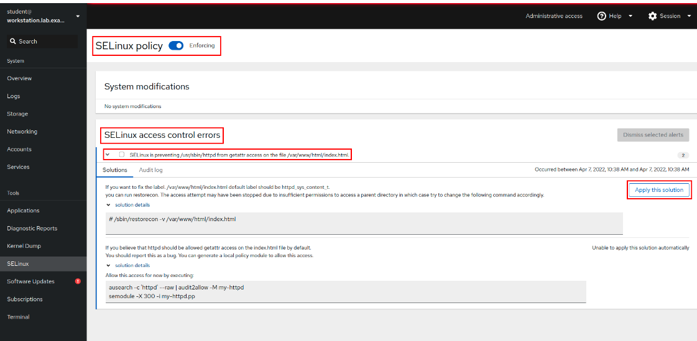

# SELinux 부울(Boolean)
- SELinux는 서비스나 애플리케이션의 동작을 세밀하게 제어할 수 있도록 다양한 보안 정책을 제공
- 이 중 **SELinux 부울(Boolean)**은 정책 내 **선택적 기능을 켜고 끌 수 있는 설정**
  - 부울 값은 **`on`(활성화)** 또는 **`off`(비활성화)** 상태로 설정
- 애플리케이션 또는 서비스의 SELinux 타겟 정책(targeted policy)은 기본적으로 허용되는 동작을 정의함. 하지만 어떤 경우에는 운영 환경에 따라 특정 기능이 필요하거나 불필요할 수 있음
-> 이런 기능을 제어할 수 있도록 **선택적 부울(Boolean)** 설정이 존재


## 부울 상태 확인
- 현재 시스템에 설정된 모든 SELinux 부울과 상태를 확인하기 위해서 `getsebool` or `semanage boolean -l` 명령어 사용 가능
- 모든 부울 상태 확인
```bash
[root@host ~]# getsebool -a
abrt_anon_write --> off
abrt_handle_event --> off
abrt_upload_watch_anon_write --> on
...output omitted...
```
- semanage 명령어를 활용하여 설정 확인
  - ex. httpd_use_* type 관련 Boolean 설정 확인
  - 현재 모두 off 상태이므로, Apache는 위 기능들을 사용할 수 없음
```bash
[root@serverb ~]# semanage boolean -l | grep httpd_use
#Boolean Name              (Current State, Persistent State)   Description
httpd_use_cifs              (off  ,  off)   Allow httpd to use cifs
httpd_use_fusefs            (off  ,  off)   Allow httpd to use fusefs
httpd_use_gpg               (off  ,  off)   Allow httpd to use gpg
httpd_use_nfs               (off  ,  off)   Allow httpd to use nfs
httpd_use_opencryptoki      (off  ,  off)   Allow httpd to use opencryptoki
httpd_use_openstack         (off  ,  off)   Allow httpd to use openstack
httpd_use_sasl              (off  ,  off)   Allow httpd to use sasl
```


## 부울 설정 변경 방법
- 임시로 설정 (재부팅 시 초기화됨)
```bash
setsebool httpd_use_nfs on
```
- 영구 설정
  - `-P` 옵션은 /etc/selinux/targeted/modules/active/booleans.local 파일에 저장되어 영구 반영
```bash
setsebool -P httpd_use_nfs on
```
- 변경된 설정만 확인
  - 변경된(기본값과 다른) 부울만 확인하고 싶다면 `-C` 옵션을 사용
  - `-C` 옵션은 기본 설정과 현재 설정이 다르거나, 마지막 부팅 시와 현재 설정이 다를 경우 해당 부울을 표시
```bash
[root@host ~]# semanage boolean -l -C
SELinux boolean                State  Default Description

httpd_enable_homedirs          (on   ,   on)  Allow httpd to enable homedirs
```

### Checkpoint
- bool 설정은 이미 정의되어있는 정책을 껐다 켰다 하는 것이지, context를 조정하는 것은 아님. 별개의 작업
- bool과 context가 충돌한다면? -> 둘 다 만족해야 정상적으로 동작

# sealert 활용한 모니터링
- SELinux 접근 거부 문제 발생 시, sealert 같은 툴로 원인 분석 및 해결책을 제시하는 방법을 이해하자
- SELinux는 정책 기반의 보안 시스템. 기본적으로 어떤 프로세스가 어떤 리소스(파일, 포트 등)에 대해 무슨 작업을 하려는지 정의된 정책이 없으면 작업은 거부되고 이벤트가 로깅

## setroubleshoot-server
- `setroubleshoot-server` 패키지에는 SELinux 문제를 진단해 주는 툴이 포함되어 있음
- SELinux에서 작업을 거부하면 `/var/log/audit/audit.log` 보안 로그에 AVC 메시지가 기록됨
- 문제 해결 서비스는 이 AVC 이벤트를 모니터링해서 요약을 `/var/log/messages`로 전송함

## AVC 이벤트 요약과 세부 보고서
- 요약 메시지에는 이벤트 고유의 식별자(UUID)가 포함됨
- 특정 이벤트에 대한 상세 보고서를 보려면:
```bash
sealert -l <UUID>
```
- 전체 이벤트를 보려면:
```bash
sealert -a /var/log/audit/audit.log
```
## 예시 시나리오
- Apache 웹 서버에서의 SELinux 차단 상황
```bash
[root@host ~]# touch /root/mypage
[root@host ~]# mv /root/mypage /var/www/html
[root@host ~]# systemctl start httpd
[root@host ~]# curl http://localhost/mypage
<!DOCTYPE HTML PUBLIC "-//IETF//DTD HTML 2.0//EN">
<html><head>
<title>403 Forbidden</title>
</head><body>
<h1>Forbidden</h1>
<p>You don't have permission to access this resource.</p>
</body></html>
```
- AVC 이벤트는 /var/log/audit/audit.log 및 /var/log/messages 파일에 기록됩니다.

```bash
[root@host ~]# tail /var/log/audit/audit.log
...output omitted...
type=AVC msg=audit(1649249057.067:212): avc:  denied  { getattr } for  pid=2332 comm="httpd" path="/var/www/html/mypage" dev="vda4" ino=9322502 scontext=system_u:system_r:httpd_t:s0 tcontext=unconfined_u:object_r:admin_home_t:s0 tclass=file permissive=0
...output omitted
[root@host ~]# tail /var/log/messages
...output omitted...
Apr  6 08:44:19 host setroubleshoot[2547]: SELinux is preventing /usr/sbin/httpd from getattr access on the file /var/www/html/mypage. For complete SELinux messages run: sealert -l 95f41f98-6b56-45bc-95da-ce67ec9a9ab7
...output omitted...
```

- sealert를 활용해서 이벤트 내용, 영향받는 프로세스, 액세스한 파일, 시도 및 거부된 작업 등 확인 가능
- 틀릴 수도 있다~! 
```bash
[root@host ~]# sealert -l 95f41f98-6b56-45bc-95da-ce67ec9a9ab7
SELinux is preventing /usr/sbin/httpd from getattr access on the file /var/www/html/mypage.

*****  Plugin restorecon (99.5 confidence) suggests   ************************

If you want to fix the label.
/var/www/html/mypage default label should be httpd_sys_content_t.
Then you can run restorecon. The access attempt may have been stopped due to insufficient permissions to access a parent directory in which case try to change the following command accordingly.
Do
# /sbin/restorecon -v /var/www/html/mypage

*****  Plugin catchall (1.49 confidence) suggests   **************************

If you believe that httpd should be allowed getattr access on the mypage file by default.
Then you should report this as a bug.
You can generate a local policy module to allow this access.
Do
allow this access for now by executing:
# ausearch -c 'httpd' --raw | audit2allow -M my-httpd
# semodule -X 300 -i my-httpd.pp


Additional Information:
Source Context                system_u:system_r:httpd_t:s0
Target Context                unconfined_u:object_r:admin_home_t:s0
Target Objects                /var/www/html/mypage [ file ]
Source                        httpd
Source Path                   /usr/sbin/httpd
...output omitted...

Raw Audit Messages
type=AVC msg=audit(1649249057.67:212): avc:  denied  { getattr } for  pid=2332 comm="httpd" path="/var/www/html/mypage" dev="vda4" ino=9322502 scontext=system_u:system_r:httpd_t:s0 tcontext=unconfined_u:object_r:admin_home_t:s0 tclass=file permissive=0

type=SYSCALL msg=audit(1649249057.67:212): arch=x86_64 syscall=newfstatat success=no exit=EACCES a0=ffffff9c a1=7fe9c00048f8 a2=7fe9ccfc8830 a3=100 items=0 ppid=2329 pid=2332 auid=4294967295 uid=48 gid=48 euid=48 suid=48 fsuid=48 egid=48 sgid=48 fsgid=48 tty=(none) ses=4294967295 comm=httpd exe=/usr/sbin/httpd subj=system_u:system_r:httpd_t:s0 key=(null)

Hash: httpd,httpd_t,admin_home_t,file,getattr
```

- /var/log/audit/audit.log를 참고하는 ausearch 명령어를 활용해 로그 파일에서 AVC 이벤트를 검색할 수 있음.
- `-m` 옵션을 사용하여 AVC 메시지 유형을 지정하고 -ts 옵션을 사용하여 recent와 같은 시간 힌트를 제공
```bash
[root@host ~]# ausearch -m AVC -ts recent
----
time->Tue Apr  6 13:13:07 2019
type=PROCTITLE msg=audit(1554808387.778:4002): proctitle=2F7573722F7362696E2F6874747064002D44464F524547524F554E44
type=SYSCALL msg=audit(1554808387.778:4002): arch=c000003e syscall=49 success=no exit=-13 a0=3 a1=55620b8c9280 a2=10 a3=7ffed967661c items=0 ppid=1 pid=9340 auid=4294967295 uid=0 gid=0 euid=0 suid=0 fsuid=0 egid=0 sgid=0 fsgid=0 tty=(none) ses=4294967295 comm="httpd" exe="/usr/sbin/httpd" subj=system_u:system_r:httpd_t:s0 key=(null)
type=AVC msg=audit(1554808387.778:4002): avc:  denied  { name_bind } for  pid=9340 comm="httpd" src=82
```
- cockpit 화면에서도 `sealert` 메세지와 동일한 내용 확인 가능
