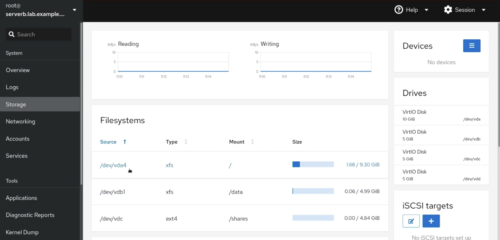

# 파일 시스템 마운트와 파티셔닝
블록 스토리지인 디스크는 나눠서 사용할 수 있음 (ex. `/dev/vdb` 블록 장치가 있을 때, `vdb1, vdb2`같이 원하는 만큼 파티션을 나눠서 사용할 수 있음)
> 블록 디바이스란?
> - 블록 단위(일정 크기)로 데이터를 읽고 쓸 수 있는 저장장치(디스크, SSD 등)를 의미
- 파티션은 고유 번호가 있음
- 예전에 왜 파티션을 나누는지 살펴본 적 있음
  - 애플리케이션 또는 사용자가 사용할 수 있는 공간을 제한할 수 있음
  - 사용자 파일에서 운영 체제와 프로그램 파일을 구분할 수 있음
  - 디스크 공간 사용을 제한하여 진단 도구 및 백업 이미징의 성능을 향상
  - 메모리 스왑을 위해 별도 영역을 생성 가능

> 메모리 스왑
> - RAM이 부족할 때 디스크의 일부를 임시 메모리처럼 사용하는 것

## 파티션 체계
- MBR, GPT 두 가지 선택지

> BIOS와 UEFI란?
> 컴퓨터를 켤 때 가장 먼저 실행되는 프로그램은 운영체제가 아니라 **펌웨어**임. 이 펌웨어가 하드웨어를 초기화하고 운영체제를 부팅시킴. 대표적으로 전통적인 **BIOS**와 더 현대적인 **UEFI**가 있음.
>
>| 항목       | BIOS                                  | UEFI                                           |
>|------------|---------------------------------------|------------------------------------------------|
>| 이름       | Basic Input/Output System             | Unified Extensible Firmware Interface         |
>| 등장 시기  | 1980년대 초                           | 2000년대 이후                                 |
>| 방식       | 하드웨어 근접, 16비트 모드            | 소프트웨어에 가까운 구조, 32/64비트 모드      |
>| 저장 위치  | 메인보드 칩셋 내 ROM                  | EFI 시스템 파티션(ESP)                         |
>| 인터페이스 | 키보드 기반, 텍스트 UI                | 마우스 지원 가능, 그래픽 UI                   |


### MBR 파티션 체계
- MBR(Master Boot Record) 파티셔닝 체계는 **BIOS** 펌웨어를 실행하는 시스템의 표준.
- 최대 네 개의 주 파티션을 지원
- Linux 시스템에서는 확장 및 논리 파티션을 사용하여 최대 15개의 파티션을 생성할 수 있음
- 파티션 크기가 32비트인 경우 MBR로 파티셔닝되는 디스크 크기는 최대 2TiB
- 결과적으로 레거시 MBR 체계가 GPT(GUID Partition Table) 파티셔닝 체계로 대체됨

### GPT 파티션 테이블
- GPT(GUID Partition Table)는 **UEFI** 펌웨어를 실행하는 시스템의 표준.
- UEFI 환경에서는 GPT 파티션 테이블을 사용해야 하며, 더 많은 파티션과 대용량 디스크를 지원함
- GPT는 최대 128개의 파티션을 제공
- GPT 체계는 논리 블록 주소에 64비트를 할당하여 최대 8제비바이트(ZiB) 또는 80억 테비바이트(TiB)의 파티션 및 디스크를 지원
- GPT 파티셔닝은 MBR에 비해 더 많은 기능과 이점을 제공
  - GPT는 GUID(전역 고유 식별자)를 사용하여 각 디스크와 파티션을 식별
  - GPT는 기본 GPT를 디스크 헤드에, 백업 보조 GPT를 디스크 끝부분에 배치하여 파티션 테이블을 이중화
    - "파티션 테이블"을 이중화
    ```
      [디스크 앞]                                      [디스크 끝]
      | Primary GPT Header + Partition Table |   ...   | Backup GPT Header + Backup Partition Table |
    ```
  - GPT는 체크섬을 사용하여 GPT 헤더와 파티션 테이블에서 오류를 감지
  
## 파티션 관리
- 여러가지 툴을 상황에 맞게 쓸 수 있음
- ex. web console, ansible, fdisk, gdisk, parted..
  - 선생님은 제일 사용하기 쉬운 web console 과 선언적으로 동작하는 ansible 추천. ansible은 시스템 규모가 클 때 더 이점이 있음
> 선언적이란?
> - 원하는 상태(결과)를 기술하고, 시스템이 그 상태가 되도록 자동으로 처리하는 방식
> - k8s 예시:  
>   ```yaml
>   apiVersion: apps/v1
>   kind: Deployment
>   spec:
>     replicas: 3
>     ...
>   ```
>   위처럼 yaml 파일에 "nginx 파드가 3개 떠 있는 상태"를 선언하면,  
>   쿠버네티스가 실제로 그 상태가 되도록 자동으로 처리함  
> -  반대로 명령적(Imperative) 방식은 사용자가 "어떻게" 할지 일련의 명령을 직접 순서대로 실행함  
>   - 예: `kubectl run ...`, `fdisk`에서 직접 파티션 생성 명령을 입력하는 것

## Web Console 파티셔닝
- Storage Tab으로 들어간다
  - Storage Tab이 존재하지 않을 수 있다. 관련 패키지를 설치함으로써 해결할 수 있음

```bash
dnf install -y cockpit-storaged
```


- UI상에서 파티션, 포맷 등 작업 가능


## parted
### 조회 및 파티션
- 하위 명령인 `print`를 사용하여 `/dev/vda` 블록 디바이스 파티션 테이블을 표시
  - 총 용량 53.7GB, 섹터 크기는 512B.
  - 파티션 테이블: MBR(msdos) 방식으로 구성됨. 최대 4개의 primary 파티션만 가능함
  - 파티션 1: 10.7GB 크기의 primary 파티션, xfs 파일 시스템 사용, 부팅 가능(boot 플래그 설정)
    - 시작 위치가 1049kB인 이유는 MBR 파티션 테이블과 부트 로더 공간(첫 1MB)을 피하기 위함
  - 파티션 2: 42.9GB 크기의 primary 파티션, xfs 파일 시스템 사용, 부팅 플래그는 없음

```bash
[root@host ~]# parted /dev/vda print
Model: Virtio Block Device (virtblk)
Disk /dev/vda: 53.7GB
Sector size (logical/physical): 512B/512B
Partition Table: msdos
Disk Flags:

Number  Start   End     Size    Type     File system  Flags
 1      1049kB  10.7GB  10.7GB  primary  xfs          boot
 2      10.7GB  53.7GB  42.9GB  primary  xfs
```
>sector란?
> - 디스크를 구성하는 최소 단위의 저장 공간(일반적으로 512바이트)

- 대화 형식으로 파티셔닝 가능
  - 새 드라이브를 파티셔닝하려면 먼저 디스크 레이블을 작성
  - 디스크 레이블은 사용할 파티셔닝 체계를 나타냄. parted를 사용하여 MBR 디스크 레이블 또는 GPT 디스크 레이블을 작성
```bash
[root@host ~]# parted /dev/vdb
GNU Parted 3.1
Using /dev/vdb
Welcome to GNU Parted! Type 'help' to view a list of commands.

(parted) mklabel msdos
Warning: The existing disk label on /dev/vdb will be destroyed and all data on this disk will be lost. Do you want to continue?
Yes/No? Yes

(parted) mkpart primary xfs 1MiB 5GiB
Warning: The resulting partition is not properly aligned for best performance.
Ignore/Cancel? Ignore

(parted) mkpart primary xfs 5GiB 100%
Warning: The resulting partition is not properly aligned for best performance.
Ignore/Cancel? Ignore

(parted) print
Model: Virtio Block Device (virtblk)
Disk /dev/vdb: 53.7GB
Sector size (logical/physical): 512B/512B
Partition Table: msdos
Disk Flags:

Number  Start   End     Size    Type     File system  Flags
 1      1049kB  5000MB  4999MB  primary  xfs
 2      5000MB  53.7GB  48.7GB  primary  xfs

(parted) quit
Information: You may need to update /etc/fstab.
```
- Linux 시스템에서 udev 이벤트가 모두 처리될 때까지 대기하는 `udevadm settle` 수행
  - 디바이스 관련 변경사항(예: 디스크 추가, 파티션 생성 등)에 대해
udev가 모든 작업을 끝마칠 때까지 기다리는 것
  - 파티션 생성 후 `lsblk`, `blkid` 등에 정확히 반영되도록 하기 위해 자주 사용됨
  - `udev`는 백그라운드에서 `/dev/vdb1` 같은 디바이스 파일을 만듦
  - `udevadm settle` 없이 바로 다음 명령어를 실행하면, 아직 장치 노드가 생성되지 않아 오류가 날 수 있음

### 삭제
- 대화형 명령어
  - 파티션 번호 식별 후 삭제
```bash
[root@host ~]# parted /dev/vdb
GNU Parted 3.4
Using /dev/vdb
Welcome to GNU Parted! Type 'help' to view a list of commands.
(parted) print
Model: Virtio Block Device (virtblk)
Disk /dev/vdb: 5369MB
Sector size (logical/physical): 512B/512B
Partition Table: gpt
Disk Flags:

Number  Start   End     Size   File system  Name       Flags
 1      1049kB  1000MB  999MB  xfs          usersdata
(parted) rm 1
(parted) quit
Information: You may need to update /etc/fstab.
```

- 단일 명령어 모드에서는 아래 명령 사용 가능
`[root@host ~]# parted /dev/vdb rm 1`

## 파일 시스템 생성
- 블록 장치에 파일 시스템을 추가할 수 있음
- Red Hat Enterprise Linux는 다양한 파일 시스템 유형을 지원하며 권장되는 기본값은 XFS
-  root 사용자로 `mkfs.xfs` 명령을 사용하여 블록 장치에 XFS 파일 시스템을 적용. ext4 파일 시스템의 경우 `mkfs.ext4` 명령을 사용

```bash
[root@host ~]# mkfs.xfs /dev/vdb1
meta-data=/dev/vdb1              isize=512    agcount=4, agsize=60992 blks
         =                       sectsz=512   attr=2, projid32bit=1
         =                       crc=1        finobt=1, sparse=1, rmapbt=0
         =                       reflink=1    bigtime=1 inobtcount=1
data     =                       bsize=4096   blocks=243968, imaxpct=25
         =                       sunit=0      swidth=0 blks
naming   =version 2              bsize=4096   ascii-ci=0, ftype=1
log      =internal log           bsize=4096   blocks=1566, version=2
         =                       sectsz=512   sunit=0 blks, lazy-count=1
realtime =none                   extsz=4096   blocks=0, rtextents=0
```

## 파일 시스템 마운트
- 디렉터리 구조의 디렉터리에 파일 시스템을 마운트하여 사용자 공간 유틸리티가 장치의 파일에 액세스하거나 쓸 수 있도록 함

### 파일 시스템 임시 마운트
- `mount` 명령을 사용
  - 장치 및 마운트 지점이 필요
  - 마운트 옵션이 포함 가능

  | 옵션   | 설명                     | 예시             |
  | ---- | ---------------------- | -------------- |
  | `-t` | 파일 시스템 타입 지정           | `-t xfs`       |
  | `-o` | 마운트 옵션 설정              | `-o ro,noexec` |
  | `-a` | `/etc/fstab` 기반 전체 마운트 | `mount -a`     |

```bash
[root@host ~]# mount /dev/vdb1 /mnt
```

- `mount` 명령을 사용하여 현재 마운트된 파일 시스템, 마운트 지점 및 해당 옵션을 확인 가능
```bash
# rw: 읽기/쓰기 가능 모드
# relatime: 최근 접근 시간(atime)을 변경할 때만 기록하여 디스크 입출력을 줄이는 최적화 방식 (기본값) 보기만 하면 업데이트 x
# seclabel: SELinux 등의 **보안 라벨(security label)**을 지원함을 의미
# attr2: XFS 고급 확장 파일 속성 포맷을 사용 (XFS의 향상된 메타데이터 저장 방식)
# inode64: 2TiB 이상의 디스크에서 inode를 32비트 범위를 넘어 자유롭게 배치 가능
# noquota: 디스크 사용량 제한(quota)을 적용하지 않음
[root@host ~]# mount | grep vdb1
/dev/vdb1 on /mnt type xfs (rw,relatime,seclabel,attr2,inode64,noquota)
```

### 파일 시스템 영구 마운트
- 임시로 수동으로 마운트할 경우 포맷된 장치가 액세스 가능하며 예상한 대로 작동하는지 쉽게 확인할 수 있지만 서버가 재부팅되면 시스템에서 파일 시스템을 다시 자동으로 마운트하지 않음
- 시스템 부팅 시 파일 시스템이 자동으로 마운트되도록 구성하려면 `/etc/fstab` 파일에 항목을 추가 필요
- 이 구성 파일은 시스템 부팅 시 마운트할 파일 시스템을 나열
- `/etc/fstab` 파일은 공백으로 구분된 파일이며 행당 여섯 개의 필드 존재
```bash
[root@host ~]# cat /etc/fstab

#
# /etc/fstab
# Created by anaconda on Thu Apr 5 12:05:19 2022
#
# Accessible filesystems, by reference, are maintained under '/dev/disk/'.
# See man pages fstab(5), findfs(8), mount(8) and/or blkid(8) for more info.
#
# After editing this file, run 'systemctl daemon-reload' to update systemd
# units generated from this file.
#
UUID=a8063676-44dd-409a-b584-68be2c9f5570   /        xfs   defaults   0 0
UUID=7a20315d-ed8b-4e75-a5b6-24ff9e1f9838   /dbdata  xfs   defaults   0 0
```
- 첫 번째 필드: **장치**를 지정(ex. `UUID=a8063676-44dd-409a-b584-68be2c9f5570`)
  - 보통 `UUID`로 지정
  - `/dev/vdb1`처럼 디바이스 파일 경로를 직접 지정할 수도 있음
- 두 번째 필드: **마운트 지점**(ex. `/dbdata`)
  - 파일 시스템을 연결할 디렉터리 경로이며, 존재하지 않으면 `mkdir` 명령으로 먼저 생성해야 함
- 세 번째 필드: **파일 시스템 유형**
  - `xfs`, `ext4`와 같이 지정합니다.
- 네 번째 필드: **마운트 옵션 목록**(`default`)
  - 쉼표로 구분된 옵션
  - `defaults`는 일반적으로 사용되는 옵션들의 묶음임
    - `rw`
    - `suid`(SUID/SGID 비트 허용)
    - `dev`(장치 파일 허용. `/dev/null` 같은 특수 파일 사용 가능)
    - `exec`(실행 파일 실행 허용)
    - `auto`(mount -a 시 자동 마운트 대상 포함)
    - `nouser`(일반 사용자가 마운트 불가 only root만 가능)
    - `async`(입출력 작업 비동기 처리)
- 다섯 번째 필드: **dump 백업 여부**를 지정
  - 대부분의 현대 시스템에서는 사용되지 않으며, 일반적으로 `0`으로 설정
- 여섯 번째 필드: **부팅 시 파일 시스템 점검 순서(fsck 순서)**
  - XFS 파일 시스템은 fsck를 사용하지 않으므로 `0`을 지정
  - ext4에서는 루트 파일 시스템에 `1`, 나머지에는 `2`를 지정하여 점검 순서를 설정
  - 이를 통해 `fsck`는 루트 디스크를 먼저 점검한 뒤, 나머지 디스크들을 동시에 또는 순서대로 점검
- `/etc/fstab` 파일에 항목을 추가하거나 제거할 때는 `systemd` 데몬이 새 구성을 로드하여 사용하도록 `systemctl daemon-reload` 명령을 실행하거나 서버를 재부팅
- 또는 `mount -av`: `/etc/fstab` 파일에 정의된 모든 파일 시스템을 한 번에 마운트하는 명령어
- 올바른 mount 방법
- `/etc/fstab`수정 -> `mount -av`로 명령어 결과를 보며 수정 
- `findmnt --verify`: `mount -av`와 동일한 내용을 수행하는 명령어
- 파일 시스템 타입에 맞지 않는 옵션 등을 사용했을 때 오류 메시지 등 알 수 있음

## 기타
- `lsblk --fs` : 파일 시스템과 함께 블록 장치 표시
```bash
# UUID는 고유값이라 실제 파일시스템에서 사용
# Lable은 고유하지 않음 단순 참조용
[root@serverb ~]# lsblk --fs
NAME   FSTYPE FSVER LABEL UUID                                 FSAVAIL FSUSE% MOUNTPOINTS
vda                                                                    
├─vda1                                                                
├─vda2 vfat   FAT16       7B77-95E7                                192.8M     3% /boot/efi
├─vda3 xfs           boot 5e75a2b9-1367-4cc8-bb38-4d6abc3964b8     334.7M    32% /boot
└─vda4 xfs           root fb535add-9799-4a27-b8bc-e8259f39a767     7.6G     18% /
vdb                                                                    
└─vdb1                                                                
vdc                                                                   
vdd   
```
- blkid /dev/vdb : 특정 블록 디바이스에 대해 상세한 내용을 조회하고싶을 때
```bash                                                            
[root@serverb ~]# blkid /dev/vdb
/dev/vdb: PTUUID="532f2f2b-382b-4d32-a416-6fbbd7cf2eb6" PTTYPE="gpt"
# /dev/vdb 디스크는 GPT(GUID Partition Table) 형식으로 파티셔닝됨
# PTUUID는 디스크 전체를 식별하는 고유 ID (GPT 헤더에 저장됨)
# ※ 파일 시스템 정보는 디스크 자체에는 없음 (파티션에 있음)

[root@serverb ~]# blkid /dev/vdb1
/dev/vdb1: UUID="6c6b128e-5d3e-4b4e-9e63-6e9a2a3e9c87" TYPE="xfs" \
           PARTLABEL="Linux filesystem" PARTUUID="f30ba4d8-15b6-49f0-9d78-4836ef1b834a"
# /dev/vdb1 파티션은 XFS 파일 시스템으로 포맷됨
# UUID: 파일 시스템을 고유하게 식별하는 ID (fstab 등에 사용 가능)
# TYPE: 파일 시스템 종류 (여기서는 xfs)
# PARTLABEL: 사용자가 설정한 파티션 이름
# PARTUUID: 이 파티션 자체의 고유 ID (GPT에서 부여)

[root@serverb ~]# blkid /dev/vdc
# 출력 없음: 아직 파티션이 없거나 파일 시스템이 만들어지지 않음
# → parted로 파티션 만들고, mkfs 명령으로 포맷한 후에 blkid 출력이 생김
```

