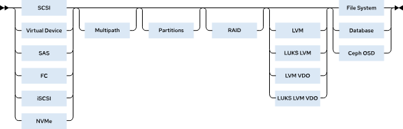
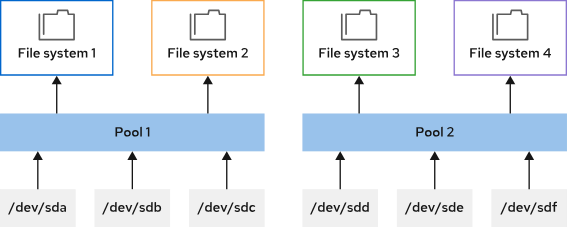

# RHEL 스토리지 스택 개요
- RHEL의 스토리지 스택은 여러 계층으로 구성
- 각 계층은 안정성, 성능, 보안, 관리 편의성을 고려해 설계
- 전체 스택을 상위에서 하위까지 간단히 설명



### 1. 블록 장치 (Block Device)
- 스토리지 스택의 가장 하단에 위치하며, 다양한 물리적/가상 장치 의미
- 데이터를 고정된 크기의 블록 단위로 읽고 쓰는 장치
- HDD, SSD
- 스토리지를 연결 인터페이스 존재

### 2. 다중 경로 (Multipath)
- 하나의 스토리지에 대해 서버와 두 개 이상 연결
- 장애 발생 시에도 다른 경로로 자동 전환할 수 있
- 하나의 스토리지에 여러 경로로 접근 가능한 경우, **Multipath**를 통해 하나의 논리 장치로 통합 가능
- `dm-multipath`를 사용해 I/O 중복 경로를 구성


### 3. 파티션 (Partitions)
- 블록 장치를 논리적으로 나눠 사용할 수 있음.
- 하나의 장치를 여러 용도로 분할 가능
- 파일 시스템, LVM, 데이터베이스 등에서 사용됨

### 4. RAID (Redundant Array of Inexpensive Disks)
- 다수의 디스크를 하나의 논리 디스크처럼 사용하도록 구성하는 방식임.
- **RAID 0/1/4/5/6/10** 등 다양한 형태 제공
- 데이터 중복성, 성능 향상 목적
- `mdadm`, `dm-raid`로 구현 가능

| RAID 레벨     | 설명                                   | 장점             | 단점                       |
| ----------- | ------------------------------------ | -------------- | ------------------------ |
| **RAID 0**  | 데이터를 디스크에 나눠서 저장 (스트라이핑)             | 빠름             | 하나라도 고장 나면 다 날아감         |
| **RAID 1**  | 같은 데이터를 두 디스크에 똑같이 저장 (미러링)          | 안전함            | 저장 공간 반으로 줄어듦            |
| **RAID 4**  | 데이터는 여러 디스크에, 오류 정정용 패리티는 별도 디스크에 저장 | 오류 복구 가능       | 패리티 디스크가 병목              |
| **RAID 5**  | 데이터와 패리티를 분산 저장                      | 효율적이고 안전       | 느릴 수 있음 (쓰기 시 패리티 계산 필요) |
| **RAID 6**  | RAID 5보다 패리티를 하나 더 저장 (2개)           | 디스크 2개까지 고장 OK | 쓰기 성능 더 느림               |
| **RAID 10** | RAID 1 + RAID 0 (미러링 + 스트라이핑)        | 빠르고 안전         | 디스크 절반만 사용 가능            |

### 5. LVM (Logical Volume Manager)

- 물리 디스크를 논리적으로 유연하게 사용할 수 있도록 구성함.
- PV (Physical Volume), VG (Volume Group), LV (Logical Volume) 개념 사용
- 스토리지 레이아웃 변경이 용이함
- 다양한 블록 장치 위에 구성 가능
- **LUKS**: 장치 수준의 암호화 제공
- **VDO**: 중복 제거(Deduplication) 및 압축 기능 제공


### 6. 최상위 계층 (File System / DB / Ceph)
- 파일 시스템
  - 일반적으로 XFS 파일 시스템 사용
  - 대부분의 사용 사례에서 권장됨
- 데이터베이스
  - 파일 시스템 위에 파일 형태로 저장 or 원시 디바이스에 직접 저장
  - 성능 최적화를 위해 자체 캐시 사용
- Ceph OSD
  - Ceph는 원시 블록 장치를 사용해 OSD 구성
  - 분산 스토리지 시스템의 저장 장치 노드
  - 블록, 오브젝트, 파일 기반 저장
  - 자체 메타데이터 구조 사용

# Stratis 스토리지 관리
- Fedora 커뮤니티에서 개발한 로컬 스토리지 관리 툴
- 스토리지 초기 구성을 수행하고, 스토리지 구성을 변경하고, 고급 스토리지 기능을 사용
- Stratis는 현재 기술 프리뷰로 제공되지만 이후 RHEL 9 버전에서 지원될 예정
- 사용자는 LVM 또는 직접적인 디스크 관리 없이도 쉽게 풀 기반 파일 시스템을 생성하고 관리함
- 내부적으로 **LVM과 device-mapper를 추상화**하여 사용자에게 더 쉬운 스토리지 관리 기능을 제공한다.

## 주요 특징

- **풀 기반 스토리지**: 하나 이상의 디스크를 묶어 풀을 생성
- **씬 프로비저닝 지원**: 필요할 때만 실제 스토리지 공간 할당
- **XFS 파일 시스템 포맷 사용**
- **파일 시스템 스냅샷 기능**
- **최대 224개의 파일 시스템을 풀 당 생성 가능**

## 주요 개념

### 풀(Pool)
- 하나 이상의 블록 장치로 구성된 저장소 단위
- 동적으로 스토리지 공간을 할당 가능
- 추가적인 블록 장치를 추가하여 확장 가능



### 씬 프로비저닝(Thin Provisioning)
- 파일 시스템 생성 시 실제 물리 공간 전체를 할당하지 않고,
- 데이터가 저장될 때마다 필요한 만큼만 동적으로 할당
- 따라서 파일 시스템이 1 TiB로 표시될 수 있지만, 풀에서 할당된 실제 스토리지의 크기는 100 GiB뿐일 수 있음

### 파일 시스템
- XFS 기반으로 생성되며, `/dev/stratis/POOL_NAME/FS_NAME` 경로로 접근 가능
- 스냅샷 생성 가능

## Stratis 관리 방법
### 설치 및 활성화
```bash
dnf install stratis-cli stratisd
systemctl enable --now stratisd
```

### Stratis 풀 생성
- stratis pool create 명령을 사용하여 하나 이상의 블록 장치로 이루어진 풀을 생성
- stratis pool list 명령을 사용하여 사용 가능한 풀 목록을 봅니다.
```bash
[root@host ~]# stratis pool create pool1 /dev/vdb
[root@host ~]# stratis pool list
Name                  Total Physical   Properties            UUID
pool1   5 GiB / 37.63 MiB / 4.96 GiB      ~Ca,~Cr   11f6f3c5-5...
```
- stratis pool add-data 명령을 사용하여 풀에 블록 장치를 추가
- stratis blockdev list 명령을 사용하여 풀의 블록 장치를 확인합니다.
```bash
[root@host ~]# stratis pool add-data pool1 /dev/vdc
[root@host ~]# stratis blockdev list pool1
Pool Name   Device Node   Physical Size   Tier
pool1       /dev/vdb              5 GiB   Data
pool1       /dev/vdc              5 GiB   Data
```

### Stratis 파일 시스템 관리
- stratis filesystem create 명령을 사용하여 풀에서 파일 시스템 생성
- Stratis 파일 시스템에 대한 링크는 /dev/stratis/pool1 디렉터리에 있음
- stratis filesystem list 명령을 사용하여 사용 가능한 파일 시스템 목록을 확인 가능
```bash
[root@host ~]# stratis filesystem create pool1 fs1
[root@host ~]# stratis filesystem list
Pool Name   Name   Used      Created             Device                   UUID
pool1       fs1    546 MiB   Apr 08 2022 04:05   /dev/stratis/pool1/fs1   c7b5719...
```
- stratis filesystem snapshot 명령을 사용하여 Stratis 파일 시스템 스냅샷을 생성
- 스냅샷은 소스 파일 시스템과 독립적. Stratis는 스냅샷 스토리지 공간을 동적으로 할당하고 초기 560 MB를 사용하여 파일 시스템의 저널을 저장
```bash
[root@host ~]# stratis filesystem snapshot pool1 fs1 snapshot1
```

### Stratis 파일 시스템 영구 마운트
- `/etc/fstab` 파일을 편집하고 파일 시스템의 세부 사항을 지정하여 Stratis 파일 시스템을 영구적으로 마운트할 수 있음
- `/etc/fstab` 파일에서 파일 시스템을 확인하는 데 사용할 파일 시스템 UUID를 표시하려면 lsblk 명령을 사용
- stratis filesystem list 명령을 사용하여 파일 시스템 UUID를 가져올 수도 있음
```bash
[root@host ~]# lsblk --output=UUID /dev/stratis/pool1/fs1
UUID
c7b57190-8fba-463e-8ec8-29c80703d45e
```
- `/etc/fstab` 예제
- `x-systemd.requires=stratisd.service` 마운트 옵션은 부팅 프로세스 중 systemd 데몬이 stratisd 서비스를 시작할 때까지 파일 시스템 마운트를 대기
```bash
UUID=c7b57190-8fba-463e-8ec8-29c80703d45e /dir1 xfs defaults,x-systemd.requires=stratisd.service 0 0
```
