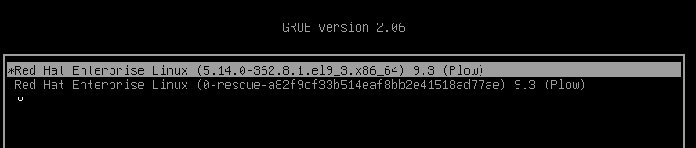
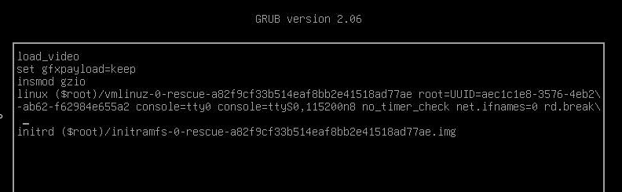

# 10.3 루트 암호 재설정
- 현재 루트 암호가 분실된 경우 시스템에 로그인하여 루트 암호를 변경함

## 부트 로더에서 루트 암호 재설정
- 만약 권한이 없지만 sudo에 대한 전체 권한이 있는 사용자로 로그인했거나, root 로 로그인 되어있는 경우는 간단함
  - sudo 권한이 있으면 `sudo passwd root`로 바로 변경 가능
  - root로 로그인되어 있으면 `passwd` 명령으로 바로 변경 가능
- 여기서는 initramfs 이미지에서 실행되는 스크립트가 특점 지점에서 일시 중지되고 root 쉘을 제공한 다음 해당 쉘이 종료될 때 계속되도록 할 수 있음 이 지점을 활용해서 root 암호를 재설정

### 수행 방법
1. 시스템 재부팅
2. Enter Key를 제외한 임의의 키를 눌러 부트 로더 카운트다운을 중단
3. 커서를 복구 커널 항목(ex. rescue..)로 이동해서 부팅

4. `e`를 눌러 선택한 항목을 편집
5. `rd.break`추가. 이 옵션을 사용해 initramfs 이미지에서 실제 시스템으로 제어 권한이 이동하기 직전에 중간

6. `ctrl+x`를 눌러 변경 사항을 적용하여 부팅
7. 메세지가 표시되면 `Enter` 키를 눌러 유지관리를 수행

- 이때 시스템에 root 쉘이 있고 디스크의 루트 파일 시스템은 `/sysroot`에 읽기 전용으로 마운트 됨. 
- 읽기/쓰기 권한으로 다시 마운트 작업
`sh-5.1# mount -o remount,rw /sysroot`
- `/sysroot`가 파일 시스템 트리의 루트로 간주되는 `chroot`환경으로 전환
  - 실제 시스템의 루트 파일시스템(`/sysroot`)을 마치 `/`인 것처럼 사용
`sh-5.1# chroot /sysroot`
- 새 root 암호를 설정
`sh-5.1# passwd root`
- 레이블이 지정되지 않은 모든 파일(`/etc/shadow` 포함)에 부팅 중 다시 레이블이 지정되도록 함
  - SELinux는 파일과 디렉터리에 보안 컨텍스트(레이블)를 부여하여 접근 제어를 수행함
  - `rd.break`로 수정한 파일들은 SELinux 레이블이 제대로 설정되지 않을 수 있음
  - `/.autorelabel` 파일이 존재하면 부팅 시 SELinux가 모든 파일의 레이블을 다시 검사하고 설정
  - 이는 보안 정책 위반을 방지하고 시스템의 무결성을 보장하기 위함임
`sh-5.1# touch /.autorelabel`
- exit을 두 번 입력
  - 첫 번째는 `chroot`환경 종료. 두 번째는 `initramfs` 디버그 쉘을 종료
  - 이 때 시스템은 부팅을 계속하며 전체 SELinux 레이블을 재지정한 다음 다시 재부팅
    - `/.autorelabel` 파일이 있으므로 시스템이 정상 부팅 후 SELinux 레이블 재설정 작업을 수행함
    - 레이블 재설정이 완료되면 시스템이 자동으로 재부팅되어 모든 보안 정책이 올바르게 적용된 상태로 시작됨

## 로그 검사
- 부팅 로그를 `journalctl` 통해 확인할 수 있음
  -  커널 이후에 시작되는 systemd 로그 관리자
  - `GRUB2` 부트로더 이후 내용 부터 조회 가능
- 기본적으로 시스템 저널은 `/run/log/journal` 디렉터리에서 보관
  - 재부팅 시 삭제
  - 영구적으로 저장하고 싶다면 `/etc/systemd/journald.conf`에서 `Storage=persistent`로 설정 필요
- 부팅 로그 검사 
  - `journalctl` 명령에 `-b` 옵션 사용
  - `-b`옵션에 음수 인자를 넘겨주지 않으면 부팅 이후 로그 표시
  ```bash
  [root@host ~]# journalctl -b -1 -p err
  Jul 07 08:34:17 host kernel: EXT4-fs (sda1): warning: mounting fs with errors, running e2fsck is recommended
  Jul 07 08:34:17 host kernel: EXT4-fs (sda1): re-mounted. Opts: (null)
  Jul 07 08:34:18 host systemd[1]: Failed to start Load Kernel Modules.
  Jul 07 08:34:18 host systemd[1]: modprobe@drm.service: Main process exited, code=exited, status=1/FAILURE
  Jul 07 08:34:18 host systemd[1]: Failed to start Create Static Device Nodes in /dev.
  Jul 07 08:34:19 host systemd-udevd[230]: could not read from '/sys/module/...': No such file or directory
  Jul 07 08:34:20 host kernel: psmouse serio1: lost sync at byte 1
  Jul 07 08:34:20 host kernel: psmouse serio1: driver resynced.
  ```

## Systemd 부팅 문제 해결
- 디버그 쉘 활용, 긴급 및 복구 타겟 사용 작업으로 복구 시도 가능

### 디버그 쉘 활성화
- 비밀번호 찾기 위해 디버그 쉘을 사용했던 것과 유사
  1. 시스템을 재부팅합니다.
  2. Enter 키를 제외한 임의의 키를 눌러서 부트 로더 카운트다운을 중단합니다.
  3. 커서를 부팅할 커널 항목으로 이동합니다.
  4. e 를 눌러 선택한 항목을 편집합니다.
  5. 커서를 커널 명령줄(linux로 시작하는 행)로 이동합니다.
  6. systemd.debug-shell을 추가합니다. 이 매개 변수를 사용하면 시스템이 디버그 쉘로 부팅됩니다.
  7. Ctrl+x 를 눌러 변경 사항을 적용하여 부팅합니다.
- 로그인 없이도 root 쉘이 열리기 때문에 보안상 절대 사용하면 안됨
- 이전에 `rd.break`는 부팅 이전 initramfs 단계에서 브레이크

### 긴급 및 복구 터미널 사용
- 부트 로더에서 커널 명령줄에 systemd.unit=rescue.target 또는 systemd.unit=emergency.target 을 추가
  - 커널 선택하고 `e`추가 (위의 내용과 동일)
- `systemd.debug-shell` 과의 차이?
  - `systemd.debug-shell`은 정상 부팅이 끝난 뒤에 실행되기 때문에, fstab 오류처럼 부팅 자체를 막는 문제는 해결할 수 없음
  - `systemd.unit=emergency.target` 등은 systemd가 아예 최소한의 장치만 초기화하고, 루트 파일 시스템만 읽기 전용으로 마운트한 뒤, 바로 root 쉘을 실행

# 부팅 시 파일 시스템 문제 복구
- 부팅 프로세스를 중단하는 파일 시스템 구성 또는 손상 문제를 수동으로 복구
## 파일 시스템 문제
- 부팅 프로세스 중 systemd 서비스는 `/etc/fstab` 파일에 정의된 영구 파일 시스템을 마운트
- 이 경우 부팅 프로세스 실패
- `/etc/fstab`에 file system type을 잘 못 작성하거나 UUID가 존재하지 않는 등 ..

### 부팅 시 파일 시스템 문제 복구
- 파일 시스템 문제로 인해 부팅을 완료할 수 없는 시스템에 액세스하기 위해 액세스에 root 암호가 필요한 긴급 쉘을 여는 emergency 부팅 타겟을 제공
- example
```bash
...output omitted...
[*     ] A start job is running for /dev/vda2 (27s / 1min 30s)
[ TIME ] Timed out waiting for device /dev/vda2.
[DEPEND] Dependency failed for /mnt/mountfolder
[DEPEND] Dependency failed for Local File Systems.
[DEPEND] Dependency failed for Mark need to relabel after reboot.
...output omitted...
[  OK  ] Started Emergency Shell.
[  OK  ] Reached target Emergency Mode.
...output omitted...
Give root password for maintenance
(or press Control-D to continue):
```
- mount 실패 상황
- 유지 관리 액세스를 위해 비상 쉘 오픈
- mount 명령을 사용하여 systemd 데몬에서 현재 마운트한 파일 시스템을 찾음
```bash
[root@host ~]# mount
...output omitted...
/dev/vda1 on / type xfs (ro,relatime,seclabel,attr2,inode64,noquota)
...output omitted...
```
- `/etc/fstab` 편집을 위해 rw 옵션으로 재마운트
```bash
[root@host ~]# mount -o remount,rw /
```
- `mount --all` 옵션을 사용하여 `/etc/fstab` 파일에 나열된 모든 파일 시스템을 마운트. 이 과정에서 발생하는 오류 파악
```bash
[root@host ~]# mount --all
mount: /mnt/mountfolder: mount point does not exist.
```
