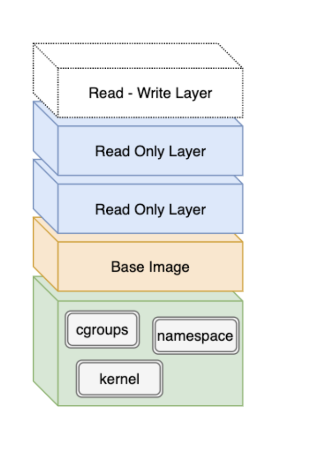
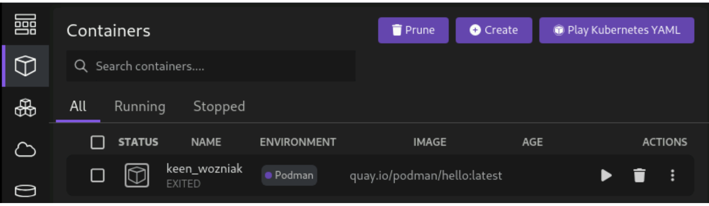
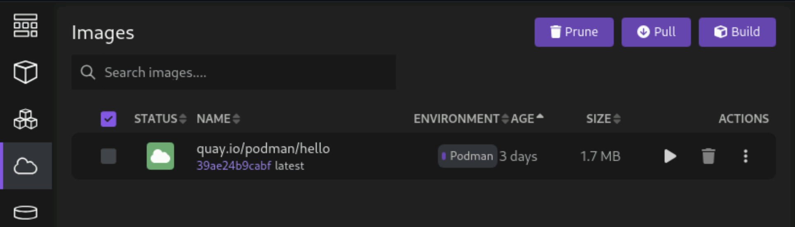

# 컨테이너 소개
- 컨테이너의 개념과 컨테이너 빌드, 저장, 실행에 관한 내용을 살펴봄

## 컨테이너란?
- 프로그램을 실행하는 데 필요한 런타임 종속성이 포함된 캡슐화된 프로세스
- 컨테이너에서 애플리케이션별 라이브러리는 호스트 운영 체제 라이브러리와 독립적
- 컨테이너화된 애플리케이션과 관련이 없는 라이브러리와 함수는 운영 체제 및 커널에서 제공
  - 예: 네트워크 통신, 메모리 할당 등의 기본 시스템 호출
- 컨테이너 엔진에서는 컨테이너 이미지 계층을 병합하여 통합 파일 시스템을 만듦
- 컨테이너 이미지 계층은 변경할 수 없으므로 컨테이너 엔진은 런타임 파일을 수정하기 위해 쓰기 가능한 계층을 추가
  - 컨테이너는 기본적으로 임시적 성질을 가짐. 컨테이너를 제거하면 컨테이너 엔진에서 쓰기 가능한 계층을 제거


- 컨테이너는 네임스페이스 및 제어 그룹(cgroups), 보안 컴퓨팅 모드(seccomp)와 같은 Linux 커널 기능을 사용
  - **네임스페이스(Namespaces)**: 프로세스, 네트워크, 마운트, IPC, UTS, 사용자 ID 등을 격리하여 컨테이너가 독립적인 환경을 가지도록 함
  - **cgroups(Control Groups)**: CPU 시간 할당 및 시스템 메모리와 같은 리소스 관리에 cgroups를 사용
  - **seccomp(Secure Computing Mode)**: 시스템 호출을 필터링하여 컨테이너가 실행할 수 있는 시스템 호출을 제한하여 보안 강화
- 대부분의 컨테이너는 OCI 사양을 준수하도록 발전
  - **OCI(Open Container Initiative)**: Linux Foundation에서 주도하는 컨테이너 표준화 프로젝트로, 컨테이너 이미지와 런타임에 대한 공개 표준을 정의

## 이미지와 인스턴스 비교
- 컨테이너 이미지: 애플리케이션과 해당 라이브러리를 정의하는 데이터가 포함되어 있으며 이 데이터는 변경할 수 없음
- 컨테이너 인스턴스: 컨테이너 이미지의 인스턴스. 네트워킹, 디스크 및 기타 런타임 필수 항목에 대한 참조를 포함하는 실행 가능한 이미지 버전
- 단일 컨테이너 이미지를 여러 번 사용하여 여러 개의 개별 컨테이너 인스턴스를 만들 수 있음
- OCI 컨테이너 이미지는 image-spec 사양으로 정의되는 반면, OCI 컨테이너 인스턴스는 runtime-spec 사양으로 정의됨
  - **image-spec**: 컨테이너 이미지의 구조, 메타데이터, 계층화된 파일 시스템을 정의하는 표준
  - **runtime-spec**: 컨테이너가 실행될 때 필요한 환경 설정, 네임스페이스, cgroups, 보안 설정 등을 정의하는 표준
  - 객체 지향 프로그래밍에서 오브젝트가 클래스와 관련되는 것처럼 인스턴스가 이미지와 관련

## 컨테이너와 가상 시스템(VM) 비교
- **VM은 전체 운영체제를 가상화하는 반면, 컨테이너는 애플리케이션과 라이브러리만 격리하여 실행**
- VM
  - VM은 애플리케이션에 특정 전용 하드웨어가 필요한 경우와 같이 전체 컴퓨팅 환경이 추가로 필요한 경우에 유용
  - VM은 하이퍼바이저(ex. KVM, Xen..)를 사용해 가상화 기능 구현. 완전히 가상화된 환경. 사이즈도 기가바이트 단위
  - 일반적으로 동일한 하이퍼바이저를 사용하는 이미지에 대해서만 사용 가능
  - VMware 이미지는 KVM에서 직접 실행할 수 없고, Hyper-V 이미지는 VirtualBox에서 직접 실행할 수 없음
- 컨테이너
  - OCI 규격을 준수하는 컨테이너 엔진으로 구현
  - VM과 달리 전체 가상화가 아닌 필요한 부분만 가상화하여 사용
  - 메가바이트 단위 사이즈

## 컨테이너 개발
- 로컬이나 호스트 환경에 영향받지 않고 독립적인 애플리케이션 개발 가능
- 애플리케이션 별 라이브러리 버전 충돌 문제 해결 가능

# Podman 사용하여 컨테이너 생성
- 레지스트리에서 컨테이너 이미지를 가져오고 podman을 사용해 컨테이너 실행 

## Podman
- 로컬에서 컨테이너를 관리하는 데 사용할 수 있는 오픈소스 툴
- OCI를 준수하여 개발됨
- CLI 형식으로 제공됨 (+데스크톱 애플리케이션)

> podman vs docker
> - podman은 redhat에서 개발. docker는 docker inc에서 개발
> - 운영 방식
>   - Docker는 항상 백그라운드에서 데몬 프로세스(dockerd)가 동작하며, 모든 컨테이너가 이 데몬의 자식 프로세스로 관리
>   - Podman은 데몬이 필요 없이 각 컨테이너가 독립적으로 관리되며, 사용 후 Podman 프로세스가 종료되어도 컨테이너는 동작
>     - 내부적으로 runc와 같은 런타임을 호출하는 방식으로
>     - 각 컨테이너 프로세스가 독립적이고 사용자가 직접 소유
>   - Docker는 데몬이 root 권한을 요구해 보안상 잠재적 위험이 존재. podman은 rootless
> - 호환성/마이그레이션
>   - Podman은 Docker 이미지, 명령어와 호환성이 높은 CLI를 제공
>   - 특정 도구(Docker Compose 등) 완전 호환은 일부 제한적이지만, 주요 워크플로우는 대부분 동일하게 적용
> - 성능 및 기타
>   - Podman은 데몬 없는 구조로 시스템 리소스 오버헤드가 적고 컨테이너 시작이 빠르다는 장점
>   - Docker는 풍부한 생태계, 연동 도구, 커뮤니티가 강점이며, Podman은 서버·보안이 중요한 환경에서 두각
>   - docker가 container 시장을 선빵치고 사용하기 쉬우며 예제가 많아 주도한 면이 있음

## Podman 사용
### 이미지 가져오기 및 조회
- 컨테이너에서 애플리케이션을 실행하려면 먼저 컨테이너 이미지를 생성해야 함
- `podman pull` 명령을 사용하여 이미지 레지스트리에서 컨테이너 이미지를 가져옴
```bash
[user@host ~]$ podman pull registry.redhat.io/rhel9/rhel-guest-image:9.4
Trying to pull registry.redhat.io/rhel9/rhel-guest-image:9.4...
Getting image source signatures
...output omitted...
Writing manifest to image destination
Storing signatures
b85986059f7663c1b89431f74cdcb783f6540823e4b85c334d271f2f2d8e06d6
```
- 이미지 조회
```bash
[user@host ~]$ podman images
REPOSITORY                        TAG         IMAGE ID      CREATED       SIZE
registry.redhat.io/rhel9/rhel-guest-image     9.4         52617ef413bd  2 weeks ago   216 MB
```
### 컨테이너 및 컨테이너 이미지 
- 컨테이너는 격리된 런타임 환경으로, 애플리케이션이 격리된 프로세스로 실행
- 컨테이너 이미지에는 애플리케이션을 실행하는 데 필요한 모든 종속성과 함께 패키지 버전의 애플리케이션이 포함
- `podman run` 명령어를 사용해여 컨테이너 생성
```bash
[user@host ~]$ podman run registry.redhat.io/rhel9/rhel-guest-image:9.4 \
echo 'Red Hat'
Red Hat
```
- `podman ps` 명령을 사용해 컨테이너 조회
```bash
[user@host ~]$ podman ps
CONTAINER ID  IMAGE       COMMAND     CREATED     STATUS      PORTS       NAMES
```
- `-a`옵션을 통해 중지된 컨테이너까지 조회 가능
```bash
[user@host ~]$ podman ps --all
CONTAINER ID  IMAGE                              COMMAND       CREATED       STATUS                   PORTS       NAMES
20236410bcef  registry.redhat.io/rhel9/rhel-guest-image:9.4  echo Red Hat  1 second ago  Exited (0) 1 second ago              hungry_mclaren
```
- run 명령시 `--rm`옵션을 사용하면 컨테이너 중지 시 자동으로 제거되도록 설정됨
```bash
[user@host ~]$ podman run --rm registry.redhat.io/rhel9/rhel-guest-image:9.4\
echo 'Red Hat'
Red Hat
[user@host ~]$ podman ps --all
CONTAINER ID  IMAGE                              COMMAND       CREATED       STATUS                   PORTS       NAMES
```
- run 명령시 `-p` 옵션으로 포트를 매핑할 수 있음
```bash
[user@host ~]$ podman run -p 8080:8080 \
 registry.access.redhat.com/ubi9/httpd-24:latest
...output omitted...
[Thu Jun 18 12:58:57.048491 2024] [ssl:warn] [pid 1:tid 140259.33613248] AH01909: 10.0.2.100:8443:0 server certificate does NOT include an ID which matches the server name
[Thu Jun 18 12:58:57.048899 2024] [:notice] [pid 1:tid 140259.33613248] ModSecurity for Apache/2.9.2 (http://www.modsecurity.org/) configured.
...output omitted...
[Thu Jun 18 12:58:57.136272 2024] [mpm_event:notice] [pid 1:tid 140259.33613248] AH00489: Apache/2.4.37 (Red Hat Enterprise Linux) OpenSSL/1.1.1k configured -- resuming normal operations
[Thu Jun 18 12:58:57.136332 2024] [core:notice] [pid 1:tid 140259.33613248] AH00094: Command line: 'httpd -D FOREGROUND'
```
- `-e`옵션으로 환경변수 주입 가능
```bash
[user@host ~]$ podman run -e NAME='Red Hat' \
registry.redhat.io/rhel9/rhel-guest-image:9.4 printenv NAME
Red Hat
```

## Podman Desktop
- 컨테이너를 관리하고 상호 작용하는 데 사용할 수 있는 그래픽 사용자 인터페이스
- 기본적으로 Podman 엔진을 사용하며 Docker와 같은 다른 컨테이너 엔진도 지원
- Podman Desktop을 사용하면 이미지 가져오기, 컨테이너 생성 등 podman CLI로 가능한 여러 작업을 수행할 수 있음
  - 예를 들어 다음 이미지와 같이 Containers 섹션에서 컨테이너를 생성, 나열 및 실행할 수 있음
- container

- image

